# LLM情報提供手法比較システム

このプロジェクトは、LLMに外部情報を与えるための**5つの主要手法を統一環境で比較・検証**できる**フルスタックWebアプリケーション**です。

## 🎯 背景と目的

現代のLLMアプリケーション開発において、外部情報の提供方法は成功の鍵となります。本システムでは以下の5つの主要アプローチを実装し、同一条件での比較を可能にしています：

1. **LLM単体利用**: ベースライン確認
2. **プロンプトスタッフィング**: 全情報埋め込み
3. **RAGのみ**: ベクトル検索による効率的検索
4. **Function Calling**: LLMの自律的ツール利用
5. **RAG + Function Calling**: 複合アプローチ（推奨）

各手法の**効率性・精度・柔軟性**を定量的・定性的に比較し、実用的な知見を得ることができます。

## ✨ 主な特徴

- **統一環境での比較**: 同一データ・同一質問での公正な比較
- **フルスタックWebアプリ**: PythonのFastAPIバックエンド + Next.jsフロントエンド
- **リアルタイム処理**: 処理状況・中間生成物をリアルタイム表示
- **詳細な分析機能**: トークン数・処理時間・実行ログの詳細表示
- **デモモード**: プレゼンテーション用の遅延表示機能
- **編集可能KB**: ブラウザ上でナレッジベースを直接編集可能

## 🚀 クイックスタート

### 前提条件

- Python 3.10以上
- Node.js 18以上
- Google Cloud Project（Vertex AI API有効化）

### インストール・実行

```bash
# 1. バックエンド環境構築
python -m venv .venv
.venv\Scripts\activate  # Windows
pip install -r src/backend/requirements.txt

# 2. フロントエンド環境構築
cd src/frontend
npm install

# 3. 実行（2つのターミナルで同時実行）
# ターミナル1: バックエンド
python src/backend/main.py

# ターミナル2: フロントエンド
cd src/frontend
npm run dev
```

### アクセス

- **フロントエンド**: <http://localhost:3000>
- **バックエンドAPI**: <http://localhost:8000>
- **API仕様書**: <http://localhost:8000/docs>

### 使用方法

1. 処理モードを選択（5つの手法から）
2. 質問を入力（例: 「エラーコードE-404の対処法は？」）
3. 実行ボタンをクリック
4. 結果・トークン数・処理時間を確認
5. 必要に応じてログをダウンロード

## 🔧 5つの手法の概要

### 手法1: LLM単体利用（ベースライン）

**外部情報なし**でLLMの内蔵知識のみを活用。最もシンプルで高速ですが、知識の範囲と鮮度に制限があります。

### 手法2: プロンプトスタッフィング

**全情報をプロンプトに埋め込み**。確実で理解しやすい手法ですが、大量データではトークン消費が課題となります。

### 手法3: RAGのみ

**ベクトル検索による関連情報取得**。効率的で拡張性が高く、現代的なRAGアーキテクチャの基本形です。

### 手法4: Function Callingのみ

**LLMの自律的ツール選択・実行**。動的で柔軟な情報検索が可能ですが、ツール設計の品質に依存します。

### 手法5: RAG + Function Calling（推奨）

**RAGとFunction Callingの組み合わせ**。最も柔軟で実用的ですが、複雑性が増加します。

## 🏗️ システムアーキテクチャ

### 全体システムアーキテクチャ

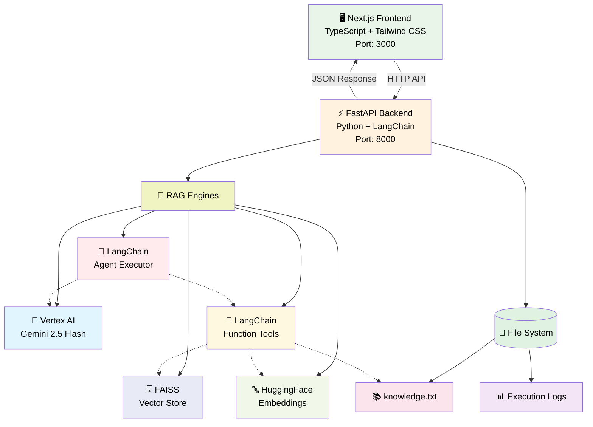

### 構成要素の説明

| 要素 | 役割 | 技術詳細 |
|------|------|----------|
| 🖥️ **Next.js Frontend** | ユーザーインターフェース | TypeScript + Tailwind CSS、レスポンシブデザイン |
| ⚡ **FastAPI Backend** | API サーバー | Python、LangChain統合、CORS対応 |
| 🔄 **RAG Engines** | 情報提供手法の実装 | 5つの異なるパターンを切り替え可能 |
| 🤖 **Vertex AI LLM** | 言語モデル | Google Gemini 2.5 Flash、テキスト生成 |
| 🗄️ **FAISS Vector Store** | ベクトルデータベース | 高速類似検索、文書の埋め込み保存 |
| 🔤 **HuggingFace Embeddings** | テキスト埋め込み | sentence-transformers、ベクトル変換 |
| 🔧 **Function Tools** | 動的ツール実行 | LangChainツール、Knowledge Base検索 |
| 🎯 **Agent Executor** | 複数ツール管理 | LangChainエージェント、戦略的実行 |
| 📚 **knowledge.txt** | ナレッジベース | 製品取扱説明書、共通データソース |
| 📊 **Execution Logs** | 実行ログ | JSONL形式、詳細な処理履歴 |

### 手法別システム構成図（静的な関係性）

各情報提供手法の静的な構成要素と関係性を可視化：

#### 手法1: LLM単体利用

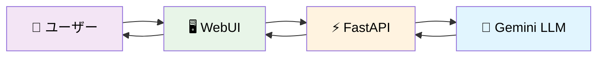

**特徴**: 最もシンプルな構成。外部情報源は一切使用せず、LLMの内蔵知識のみで回答を生成します。処理速度は最も高速ですが、知識の範囲が限定的です。

#### 手法2: プロンプトスタッフィング

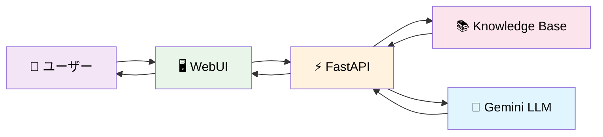

**特徴**: Knowledge Baseから全データを読み込み、質問と一緒にプロンプトに埋め込みます。確実で理解しやすい手法ですが、データ量が多い場合はトークン消費量が大きくなります。

#### 手法3: RAGのみ

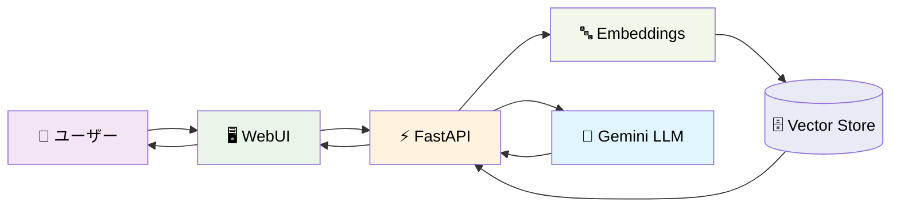

**特徴**: 質問をEmbeddingsでベクトル化し、Vector Storeから関連性の高い文書を検索して回答に活用します。効率的で拡張性が高く、現代的なRAGの基本形です。

#### 手法4: Function Callingのみ

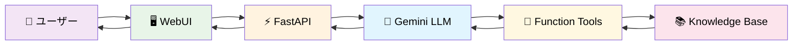

**特徴**: LLMが自律的にFunction Toolsを選択・実行してKnowledge Baseから必要な情報を取得します。LLMの判断力を活用した動的な情報検索が可能です。

#### 手法5: RAG + Function Calling（推奨）

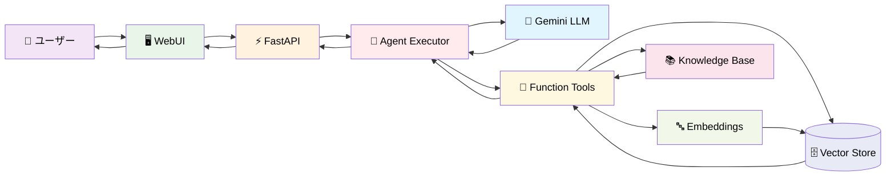

**特徴**: Agent ExecutorがLLMとFunction Toolsをオーケストレーションし、必要に応じてRAG検索（Embeddings + Vector Store）と直接的なKnowledge Base検索の両方を活用します。最も柔軟で高度な情報検索が可能な推奨手法です。

## 📊 手法別動的フロー（シーケンス図）

静的な構成図の理解に続いて、各手法の動的な処理フローをシーケンス図で説明します：

### 手法1シーケンス: LLM単体利用

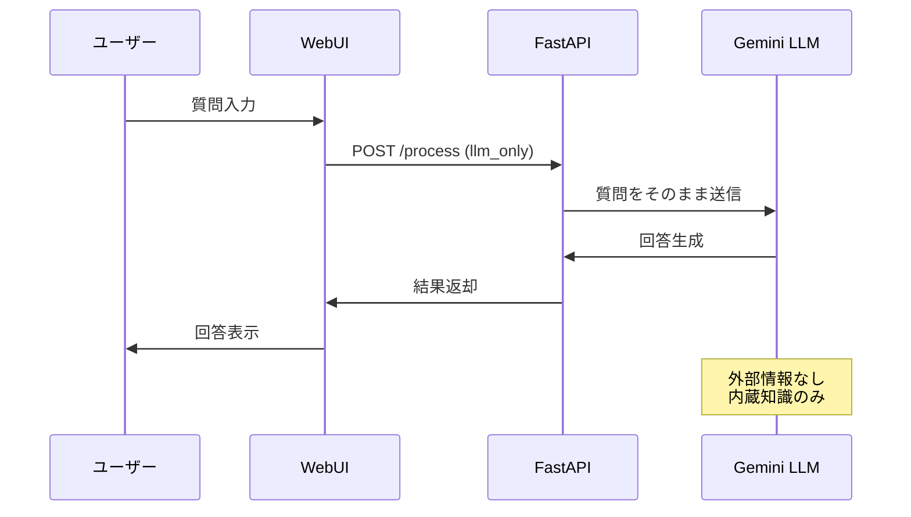

### 手法2シーケンス: プロンプトスタッフィング

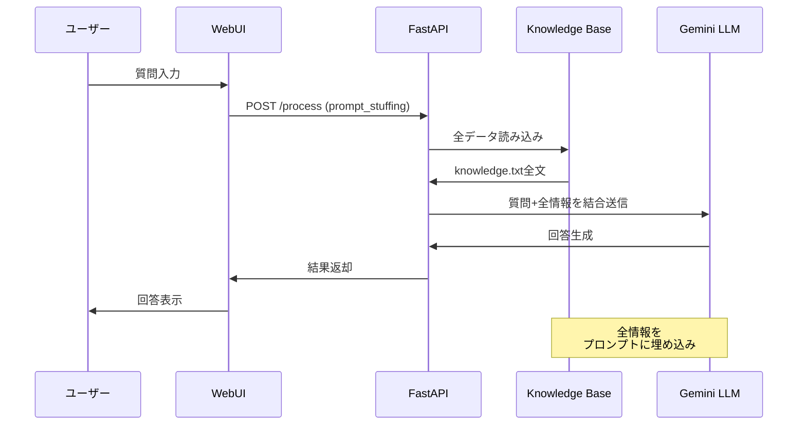

### 手法3シーケンス: RAGのみ

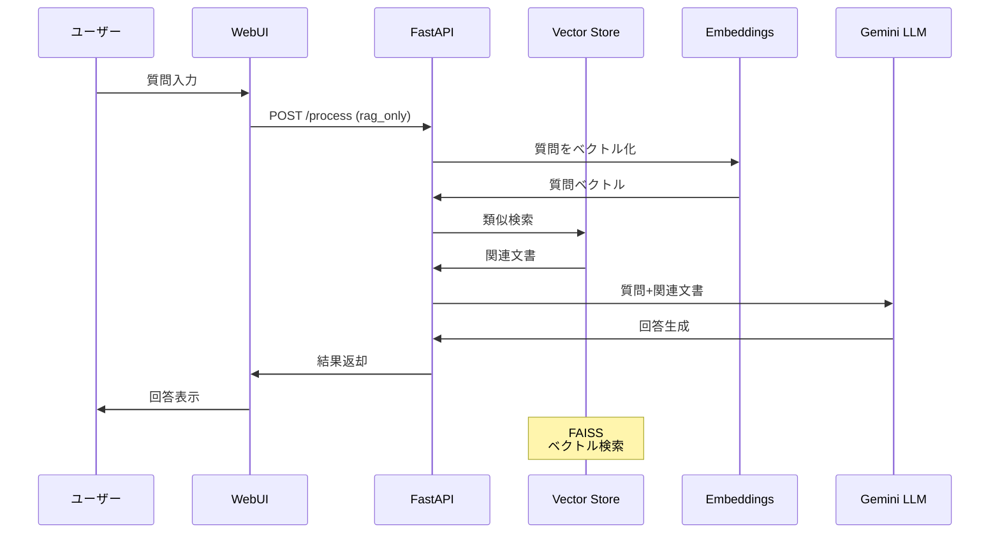

### 手法4シーケンス: Function Callingのみ

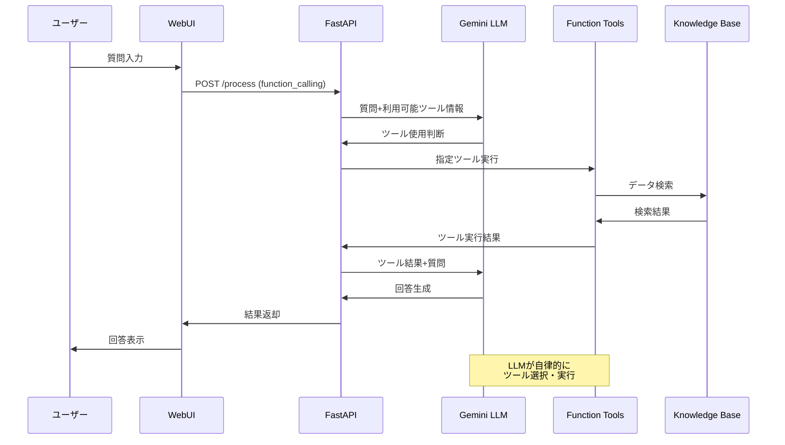

### 手法5シーケンス: RAG + Function Calling

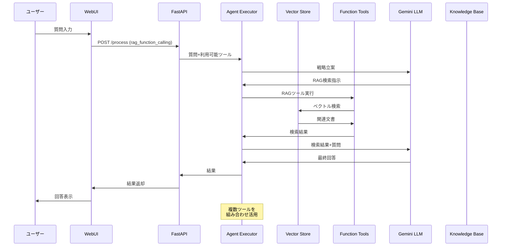

## 🔍 手法比較表

| 要素 | 手法1 LLM単体 | 手法2 スタッフィング | 手法3 RAG | 手法4 Function Calling | 手法5 RAG+FC |
|------|:---:|:---:|:---:|:---:|:---:|
| **LLM** | ✅ | ✅ | ✅ | ✅ | ✅ |
| **Knowledge Base** | ❌ | ✅ | ✅ | ✅ | ✅ |
| **Vector Store** | ❌ | ❌ | ✅ | ❌ | ✅ |
| **Embeddings** | ❌ | ❌ | ✅ | ❌ | ✅ |
| **Function Tools** | ❌ | ❌ | ❌ | ✅ | ✅ |
| **Agent Executor** | ❌ | ❌ | ❌ | ❌ | ✅ |
| **自律判断** | ❌ | ❌ | ❌ | ✅ | ✅ |
| **効率性** | ⭐⭐⭐ | ⭐ | ⭐⭐⭐ | ⭐⭐ | ⭐⭐ |
| **精度** | ⭐ | ⭐⭐⭐ | ⭐⭐⭐ | ⭐⭐ | ⭐⭐⭐ |
| **柔軟性** | ⭐ | ⭐ | ⭐⭐ | ⭐⭐⭐ | ⭐⭐⭐ |

## 🔧 技術詳細

### 使用技術

#### バックエンド

- **フレームワーク**: FastAPI
- **LLM**: Google Vertex AI (gemini-2.5-flash)
- **RAGライブラリ**: LangChain
- **ベクトル検索**: FAISS
- **埋め込みモデル**: sentence-transformers/all-MiniLM-L6-v2
- **エージェント**: LangChain AgentExecutor
- **ログ**: structlog

#### フロントエンド

- **フレームワーク**: Next.js 15 (React 19)
- **スタイリング**: Tailwind CSS
- **HTTP通信**: Axios
- **UI**: Lucide React Icons
- **通知**: React Hot Toast
- **言語**: TypeScript

### プロジェクト構成

```bash
rag-sample-codes/
├── .gitignore                       # Git除外設定
├── LICENSE                          # MITライセンス
├── README.md                        # このファイル
├── data/
│   └── knowledge.txt               # 製品取扱説明書（共通データ）
├── logs/                           # 実行ログファイル保存先
├── src/
│   ├── backend/                    # Python FastAPI バックエンド
│   │   ├── main.py                # FastAPI アプリケーション本体
│   │   ├── rag_engines.py         # 5つのRAGエンジン実装
│   │   ├── logger_config.py       # ログ設定
│   │   ├── requirements.txt       # Python依存パッケージ
│   │   ├── run_llm_only.py       # 既存実装1: LLM単体利用
│   │   ├── run_prompt_stuffing.py # 既存実装2: プロンプトスタッフィング
│   │   ├── run_rag_only.py        # 既存実装3: RAGのみ
│   │   ├── run_function_calling_only.py # 既存実装4: Function Calling
│   │   └── run_rag_plus_fancall.py # 既存実装5: RAG + Function Calling
│   └── frontend/                   # Next.js フロントエンド
│       ├── src/app/page.tsx       # メインUI
│       ├── package.json           # Node.js依存パッケージ
│       └── ... (その他Next.jsファイル)
└── .venv/                          # Python仮想環境
```

### Webアプリケーション機能

- **直感的なUI**: モダンなレスポンシブWebインターフェース
- **モード切替**: 5つの情報提供手法を簡単に切り替え可能
- **リアルタイム実行ステータス**: 処理の進行状況と中間生成物を表示
- **デモモード**: プレゼンテーション用の遅延表示機能
- **トークン使用量表示**: 入力・出力・総トークン数の詳細表示
- **ナレッジベース編集**: ブラウザ上でknowledge.txtを直接編集可能
- **実行ログ**: JSONL形式での詳細ログ自動生成・ダウンロード機能

### 各手法の実装詳細

#### 1. LLM単体利用

- **目的**: 外部情報を一切与えなかった場合のベースライン確認
- **特徴**: 純粋なLLMの知識のみで回答
- **モデル**: gemini-2.5-flash

#### 2. プロンプトスタッフィング

- **目的**: LLMのコンテキストウィンドウを活用した全情報埋め込み
- **特徴**: knowledge.txtの全内容をプロンプトに含める
- **利点**: シンプルで確実
- **欠点**: トークン消費量が多い

#### 3. RAGのみ

- **目的**: 現代的なRAGアーキテクチャの基本形
- **特徴**:
  - ベクトル検索による関連情報の取得
  - FAISS + HuggingFace Embeddings
  - LCELチェーンによる処理
- **利点**: 効率的で拡張性が高い

#### 4. Function Callingのみ

- **目的**: LLMの自律的ツール利用能力の検証
- **特徴**:
  - `@tool`デコレーターによるツール定義
  - LLMの自律的なツール選択
- **利点**: 柔軟で動的な情報取得

#### 5. RAG + Function Calling ⭐推奨⭐

- **目的**: RAG検索とツール利用の組み合わせによる最高度な構成
- **特徴**:
  - AgentExecutorによる複数ツールの管理
  - RAGをツール化した高度な検索
  - verbose=Trueで思考プロセスが見える
- **利点**: 最も柔軟で実用的

### テストクエリ

すべての実装で共通のテストクエリを使用できます：

「エラーコードE-404の対処法は？」

このクエリは、knowledge.txtに含まれる具体的な情報（E-404エラーの対処法）を問うものです。

### 期待される結果の比較

1. **LLM単体**: 一般的な知識に基づく曖昧な回答
2. **プロンプトスタッフィング**: 完全で正確な回答（トークン消費大）
3. **RAGのみ**: 関連性の高い正確な回答
4. **Function Calling**: ツール使用による動的な情報検索
5. **RAG + Function Calling**: 最も柔軟で実用的な回答

## � 詳細セットアップと使用方法

### 1. 前提条件

- Python 3.10以上
- Node.js 18以上
- Google Cloud Projectの設定（Vertex AI APIの有効化）
- 適切な認証情報の設定

### 2. インストール手順

#### バックエンド（Python）

```bash
# 仮想環境作成・有効化
python -m venv .venv
.venv\Scripts\activate  # Windows
# source .venv/bin/activate  # Linux/Mac

# 依存関係インストール
pip install -r src/backend/requirements.txt
```

#### フロントエンド（Node.js）

```bash
cd src/frontend
npm install
```

### 3. 実行方法

#### 開発サーバー起動

```bash
# バックエンド起動（ターミナル1）
python src/backend/main.py

# フロントエンド起動（ターミナル2）  
cd src/frontend
npm run dev
```

#### アクセス

- **フロントエンド**: <http://localhost:3000>
- **バックエンドAPI**: <http://localhost:8000>
- **API仕様書**: <http://localhost:8000/docs>

### 4. 使用方法

1. ブラウザで <http://localhost:3000> にアクセス
2. 処理モードを選択（5つのパターンから選択）
3. 質問を入力（例: 「エラーコードE-404の対処法は？」）
4. 「送信」ボタンをクリック
5. リアルタイムで処理状況・結果・トークン数を確認
6. 必要に応じてナレッジベースを編集
7. 実行ログをダウンロード

## 📊 ログフォーマット

実行ログは`logs/`フォルダに`YYYYMMDDHHMMSS_llm-rag-exp.jsonl`形式で保存されます：

```json
{
  "timestamp": "2025-07-02T15:30:45.123456",
  "execution_mode": "rag_function_calling",
  "query": "エラーコードE-404の対処法は？",
  "response": "...",
  "input_tokens": 150,
  "output_tokens": 200,
  "total_tokens": 350,
  "execution_time": 3.45,
  "intermediate_steps": [...],
  "demo_mode": false
}
```

## 🎓 学習ポイント

- RAGの基本的な仕組みとメリット
- Function Callingの自律性と柔軟性
- プロンプトスタッフィングのシンプルさと制限
- LLM単体の限界
- RAG + Function Callingの組み合わせによる相乗効果
- フルスタックWebアプリケーション開発
- API設計とフロントエンド・バックエンド連携

## 💡 次のステップ

このシステムを基に、以下の拡張が可能です：

- 複数のデータソースへの対応
- より高度なツールの追加
- ストリーミング対応
- マルチターン会話の実装
- 評価メトリクスの追加
- 認証・権限管理
- デプロイメント対応

## 📄 ライセンス

このプロジェクトはMITライセンスの下で公開されています。詳細は [LICENSE](LICENSE) ファイルを参照してください。

---

**注意**: このプロジェクトを実行するには、Google Cloud Projectでの適切な設定とVertex AI APIの有効化が必要です。
