# LLM情報提供手法比較システム

このプロジェクトは、LLMに外部情報を与えるための**5つの主要手法を統一環境で比較・検証**できる**フルスタックWebアプリケーション**です。

## 🎯 背景と目的

現代のLLMアプリケーション開発において、外部情報の提供方法は成功の鍵となります。本システムでは以下の5つの主要アプローチを実装し、同一条件での比較を可能にしています：

1. **LLM単体利用**: ベースライン確認
2. **プロンプトスタッフィング**: 全情報埋め込み
3. **RAGのみ**: ベクトル検索による効率的検索
4. **Function Calling**: LLMの自律的ツール利用
5. **RAG + Function Calling**: 複合アプローチ（推奨）

各手法の**効率性・精度・柔軟性**を定量的・定性的に比較し、実用的な知見を得ることができます。

## ✨ 主な特徴

- **統一環境での比較**: 同一データ・同一質問での公正な比較
- **フルスタックWebアプリ**: PythonのFastAPIバックエンド + Next.jsフロントエンド
- **リアルタイム処理**: 処理状況・中間生成物をリアルタイム表示
- **詳細な分析機能**: トークン数・処理時間・実行ログの詳細表示
- **デモモード**: プレゼンテーション用の遅延表示機能
- **編集可能KB**: ブラウザ上でナレッジベースを直接編集可能

## 🚀 クイックスタート

### 前提条件

- Python 3.10以上
- Node.js 18以上
- Google Cloud Project（Vertex AI API有効化）

### 最短設定手順

1. **Google Cloud設定**: [Google Cloud Console](https://console.cloud.google.com/)でプロジェクト作成・Vertex AI API有効化
2. **認証設定**: プロジェクトルートに`.env`ファイル作成し、`GOOGLE_CLOUD_PROJECT=your-project-id`を記載
3. **代替認証**: または`gcloud auth application-default login`でログイン

### インストール・実行

```bash
# 1. プロジェクトIDを設定（必須）
echo "GOOGLE_CLOUD_PROJECT=your-actual-project-id" > .env

# 2. バックエンド環境構築
python -m venv .venv
.venv\Scripts\activate  # Windows
pip install -r src/backend/requirements.txt

# 2. フロントエンド環境構築
cd src/frontend
npm install

# 3. 実行（2つのターミナルで同時実行）
# ターミナル1: バックエンド
python src/backend/main.py

# ターミナル2: フロントエンド
cd src/frontend
npm run dev
```

### アクセス

- **フロントエンド**: <http://localhost:3000>
- **バックエンドAPI**: <http://localhost:8000>
- **API仕様書**: <http://localhost:8000/docs>

### 使用方法

1. 処理モードを選択（5つの手法から）
2. 質問を入力（例: 「エラーコードE-404の対処法は？」）
3. 実行ボタンをクリック
4. 結果・トークン数・処理時間を確認
5. 必要に応じてログをダウンロード

## 🔧 5つの手法の概要

### 手法1: LLM単体利用（ベースライン）

**外部情報なし**でLLMの内蔵知識のみを活用。最もシンプルで高速ですが、知識の範囲と鮮度に制限があります。

### 手法2: プロンプトスタッフィング

**全情報をプロンプトに埋め込み**。確実で理解しやすい手法ですが、大量データではトークン消費が課題となります。

### 手法3: RAGのみ

**ベクトル検索による関連情報取得**。効率的で拡張性が高く、現代的なRAGアーキテクチャの基本形です。

### 手法4: Function Callingのみ

**LLMの自律的ツール選択・実行**。動的で柔軟な情報検索が可能ですが、ツール設計の品質に依存します。

### 手法5: RAG + Function Calling（推奨）

**RAGとFunction Callingの組み合わせ**。最も柔軟で実用的ですが、複雑性が増加します。

## 🏗️ システムアーキテクチャ

### 全体システムアーキテクチャ

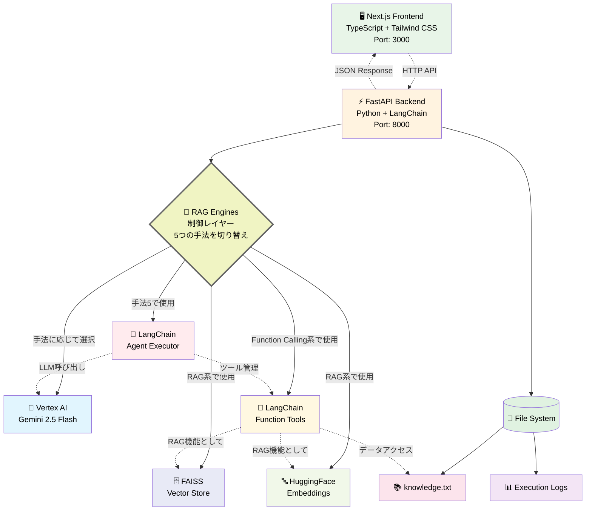

### 構成要素の説明

| 要素 | 役割 | 技術詳細 |
|------|------|----------|
| 🖥️ **Next.js Frontend** | ユーザーインターフェース | TypeScript + Tailwind CSS、レスポンシブデザイン |
| ⚡ **FastAPI Backend** | API サーバー | Python、LangChain統合、CORS対応 |
| 🔄 **RAG Engines（制御レイヤー）** | 手法切り替え制御 | 5つの情報提供パターンを統一的に管理・実行 |
| 🤖 **Vertex AI LLM** | 言語モデル | Google Gemini 2.5 Flash、テキスト生成 |
| 🗄️ **FAISS Vector Store** | ベクトルデータベース | 高速類似検索、文書の埋め込み保存 |
| 🔤 **HuggingFace Embeddings** | テキスト埋め込み | sentence-transformers、ベクトル変換 |
| 🔧 **Function Tools** | 動的ツール実行 | LangChainツール、Knowledge Base検索 |
| 🎯 **Agent Executor** | 複数ツール管理 | LangChainエージェント、戦略的実行 |
| 📚 **knowledge.txt** | ナレッジベース | 製品取扱説明書、共通データソース |
| 📊 **Execution Logs** | 実行ログ | JSONL形式、詳細な処理履歴 |

### 手法別システム構成図（静的な関係性）

各情報提供手法の静的な構成要素と関係性を可視化：

#### 手法1: LLM単体利用

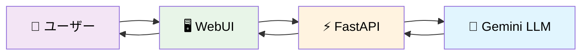

**特徴**: 最もシンプルな構成。外部情報源は一切使用せず、LLMの内蔵知識のみで回答を生成します。処理速度は最も高速ですが、知識の範囲が限定的です。

#### 手法2: プロンプトスタッフィング

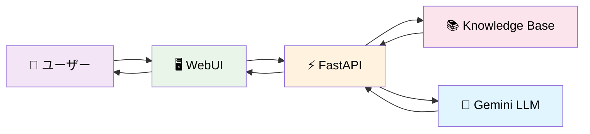

**特徴**: Knowledge Baseから全データを読み込み、質問と一緒にプロンプトに埋め込みます。確実で理解しやすい手法ですが、データ量が多い場合はトークン消費量が大きくなります。

#### 手法3: RAGのみ

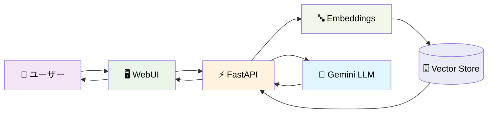

**特徴**: 質問をEmbeddingsでベクトル化し、Vector Storeから関連性の高い文書を検索して回答に活用します。効率的で拡張性が高く、現代的なRAGの基本形です。

#### 手法4: Function Callingのみ

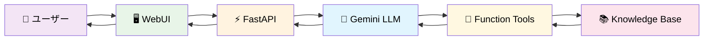

**特徴**: LLMが自律的にFunction Toolsを選択・実行してKnowledge Baseから必要な情報を取得します。LLMの判断力を活用した動的な情報検索が可能です。

#### 手法5: RAG + Function Calling（推奨）

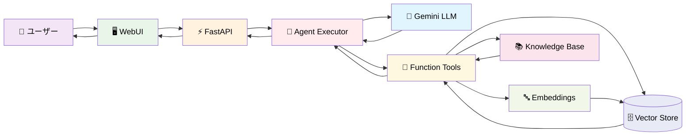

**特徴**: Agent ExecutorがLLMとFunction Toolsをオーケストレーションし、必要に応じてRAG検索（Embeddings + Vector Store）と直接的なKnowledge Base検索の両方を活用します。最も柔軟で高度な情報検索が可能な推奨手法です。

## 📊 手法別動的フロー（シーケンス図）

静的な構成図の理解に続いて、各手法の動的な処理フローをシーケンス図で説明します：

### 手法1シーケンス: LLM単体利用

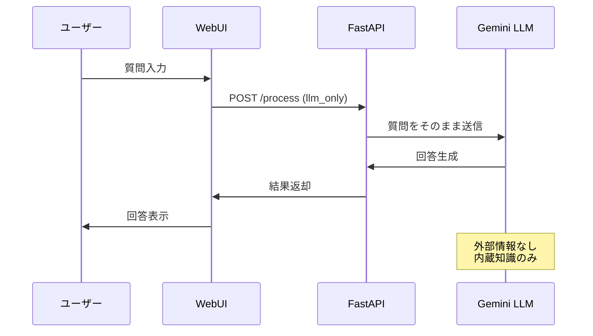

### 手法2シーケンス: プロンプトスタッフィング

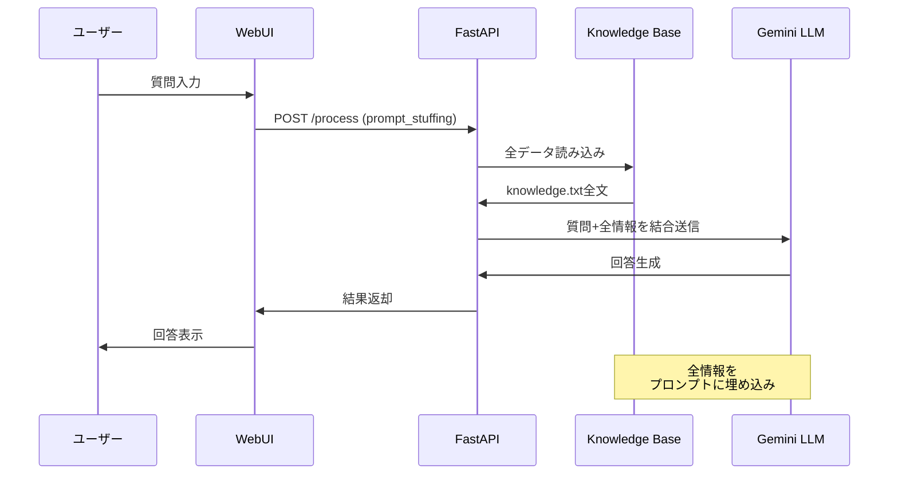

### 手法3シーケンス: RAGのみ

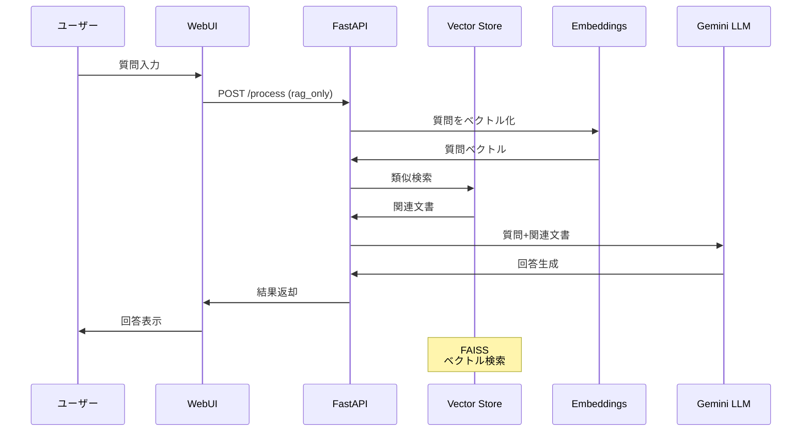

### 手法4シーケンス: Function Callingのみ

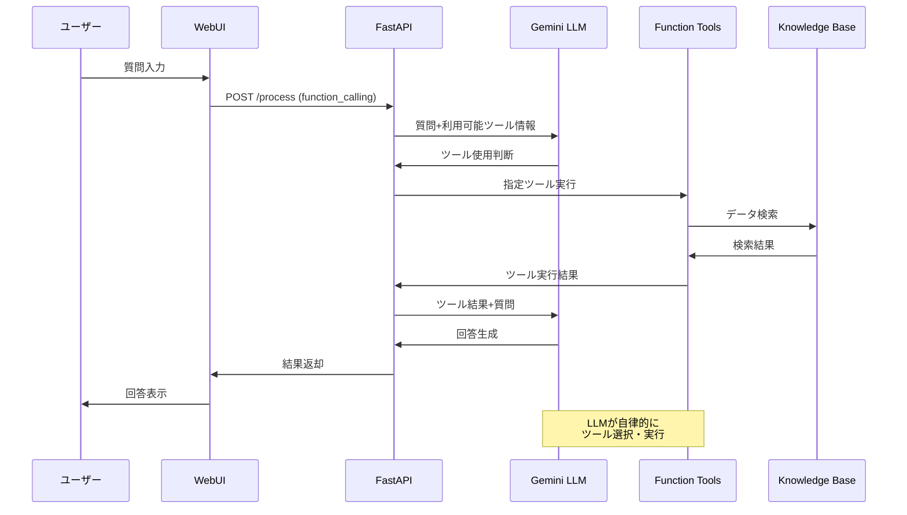

### 手法5シーケンス: RAG + Function Calling

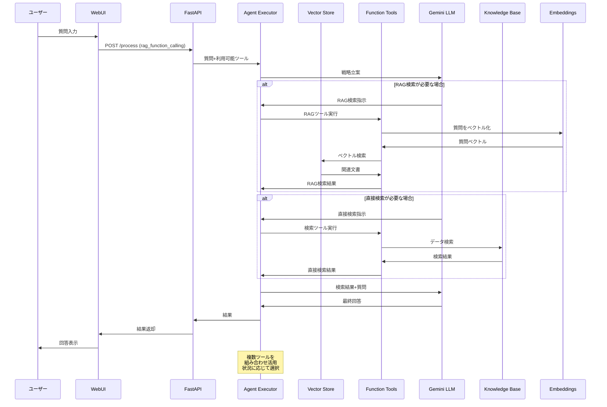

## 🔍 手法比較表

| 要素 | 手法1 LLM単体 | 手法2 スタッフィング | 手法3 RAG | 手法4 Function Calling | 手法5 RAG+FC |
|------|:---:|:---:|:---:|:---:|:---:|
| **LLM** | ✅ | ✅ | ✅ | ✅ | ✅ |
| **Knowledge Base** | ❌ | ✅ | ✅ | ✅ | ✅ |
| **Vector Store** | ❌ | ❌ | ✅ | ❌ | ✅ |
| **Embeddings** | ❌ | ❌ | ✅ | ❌ | ✅ |
| **Function Tools** | ❌ | ❌ | ❌ | ✅ | ✅ |
| **Agent Executor** | ❌ | ❌ | ❌ | ❌ | ✅ |
| **自律判断** | ❌ | ❌ | ❌ | ✅ | ✅ |
| **効率性** | ⭐⭐⭐ | ⭐ | ⭐⭐⭐ | ⭐⭐ | ⭐⭐ |
| **精度** | ⭐ | ⭐⭐⭐ | ⭐⭐⭐ | ⭐⭐ | ⭐⭐⭐ |
| **柔軟性** | ⭐ | ⭐ | ⭐⭐ | ⭐⭐⭐ | ⭐⭐⭐ |

### 📝 評価指標の説明

#### 🤖 自律判断
**定義**: LLMが状況に応じて適切なツールや検索手法を自動選択する能力

- **❌ なし**: 事前に決められた処理のみ実行
- **✅ あり**: LLMが動的にツール選択・実行戦略を決定

**読み手の判断基準**: 
- **自律判断が重要な場合**: 多様な質問に対応、予期しない情報ニーズへの対応
- **自律判断が不要な場合**: 決まったパターンの質問、予測可能な処理フロー

#### ⚡ 効率性（処理速度・リソース消費）
**定義**: レスポンス時間とトークン消費量のバランス

- **⭐⭐⭐ 高**: 高速レスポンス、少ないトークン消費
- **⭐⭐ 中**: 中程度の処理時間、適度なリソース使用
- **⭐ 低**: 処理時間が長い、大量のトークン消費

**読み手の判断基準**:
- **高効率が重要**: リアルタイム応答、大量処理、コスト重視
- **効率性より精度**: 複雑な分析、高品質な回答が必要

#### 🎯 精度（回答の正確性・関連性）
**定義**: 質問に対する回答の正確性と情報の関連性

- **⭐⭐⭐ 高**: 外部情報を活用した正確で詳細な回答
- **⭐⭐ 中**: 関連情報は取得できるが、情報選択に課題
- **⭐ 低**: 限定的な知識による曖昧または不正確な回答

**読み手の判断基準**:
- **高精度が必要**: 専門的な質問、事実確認、正確性が重要な業務
- **精度より速度**: 概要把握、ブレインストーミング、一般的な質問

#### 🔧 柔軟性（適応性・拡張性）
**定義**: 多様な質問や新しい要求に対する対応能力

- **⭐⭐⭐ 高**: 複数の検索手法、動的な戦略変更、多様な情報源に対応
- **⭐⭐ 中**: 限定的だが複数の情報取得手法を利用
- **⭐ 低**: 固定的な処理、単一の情報源に依存

**読み手の判断基準**:
- **高柔軟性が重要**: 多様な業務、予期しない質問、将来の拡張性
- **柔軟性より安定性**: 定型的な業務、予測可能な質問パターン

### 💡 手法選択のガイドライン

| 用途・要件 | 推奨手法 | 理由 |
|------------|----------|------|
| **プロトタイプ・検証** | 手法1 LLM単体 | 最速実装、基本性能確認 |
| **小規模データ・確実性重視** | 手法2 スタッフィング | シンプル、確実、理解しやすい |
| **大規模データ・効率重視** | 手法3 RAG | 高効率、拡張性、現代的手法 |
| **動的・多様な要求** | 手法4 Function Calling | 柔軟性、自律性、カスタマイズ性 |
| **本格運用・最高品質** | 手法5 RAG+FC | 総合力、実用性、将来性 |

## 🔧 技術詳細

### 使用技術

#### バックエンド

- **フレームワーク**: FastAPI
- **LLM**: Google Vertex AI (gemini-2.5-flash)
- **RAGライブラリ**: LangChain
- **ベクトル検索**: FAISS
- **埋め込みモデル**: sentence-transformers/all-MiniLM-L6-v2
- **エージェント**: LangChain AgentExecutor
- **ログ**: structlog

#### フロントエンド

- **フレームワーク**: Next.js 15 (React 19)
- **スタイリング**: Tailwind CSS
- **HTTP通信**: Axios
- **UI**: Lucide React Icons
- **通知**: React Hot Toast
- **言語**: TypeScript

### プロジェクト構成

```bash
rag-sample-codes/
├── .gitignore                       # Git除外設定
├── LICENSE                          # MITライセンス
├── README.md                        # このファイル
├── data/
│   └── knowledge.txt               # 製品取扱説明書（共通データ）
├── logs/                           # 実行ログファイル保存先
├── src/
│   ├── backend/                    # Python FastAPI バックエンド
│   │   ├── main.py                # FastAPI アプリケーション本体
│   │   ├── rag_engines.py         # 5つのRAGエンジン実装
│   │   ├── logger_config.py       # ログ設定
│   │   ├── requirements.txt       # Python依存パッケージ
│   │   ├── run_llm_only.py       # 既存実装1: LLM単体利用
│   │   ├── run_prompt_stuffing.py # 既存実装2: プロンプトスタッフィング
│   │   ├── run_rag_only.py        # 既存実装3: RAGのみ
│   │   ├── run_function_calling_only.py # 既存実装4: Function Calling
│   │   └── run_rag_plus_fancall.py # 既存実装5: RAG + Function Calling
│   └── frontend/                   # Next.js フロントエンド
│       ├── src/app/page.tsx       # メインUI
│       ├── package.json           # Node.js依存パッケージ
│       └── ... (その他Next.jsファイル)
└── .venv/                          # Python仮想環境
```

### Webアプリケーション機能

- **直感的なUI**: モダンなレスポンシブWebインターフェース
- **モード切替**: 5つの情報提供手法を簡単に切り替え可能
- **リアルタイム実行ステータス**: 処理の進行状況と中間生成物を表示
- **デモモード**: プレゼンテーション用の遅延表示機能
- **トークン使用量表示**: 入力・出力・総トークン数の詳細表示
- **ナレッジベース編集**: ブラウザ上でknowledge.txtを直接編集可能
- **実行ログ**: JSONL形式での詳細ログ自動生成・ダウンロード機能

### 各手法の実装詳細

#### 1. LLM単体利用

- **目的**: 外部情報を一切与えなかった場合のベースライン確認
- **特徴**: 純粋なLLMの知識のみで回答
- **モデル**: gemini-2.5-flash

#### 2. プロンプトスタッフィング

- **目的**: LLMのコンテキストウィンドウを活用した全情報埋め込み
- **特徴**: knowledge.txtの全内容をプロンプトに含める
- **利点**: シンプルで確実
- **欠点**: トークン消費量が多い

#### 3. RAGのみ

- **目的**: 現代的なRAGアーキテクチャの基本形
- **特徴**:
  - ベクトル検索による関連情報の取得
  - FAISS + HuggingFace Embeddings
  - LCELチェーンによる処理
- **利点**: 効率的で拡張性が高い

#### 4. Function Callingのみ

- **目的**: LLMの自律的ツール利用能力の検証
- **特徴**:
  - `@tool`デコレーターによるツール定義
  - LLMの自律的なツール選択
- **利点**: 柔軟で動的な情報取得

#### 5. RAG + Function Calling ⭐推奨⭐

- **目的**: RAG検索とツール利用の組み合わせによる最高度な構成
- **特徴**:
  - AgentExecutorによる複数ツールの管理
  - RAGをツール化した高度な検索
  - verbose=Trueで思考プロセスが見える
- **利点**: 最も柔軟で実用的

### RAG精度改善のベストプラクティス

RAGシステムの検索精度が低い場合の改善手法について、本プロジェクトでの実装経験に基づいてまとめます。

#### 一般的な問題とその原因

RAGシステムでよく発生する問題：

1. **具体的なクエリは成功するが、広い概念のクエリで失敗する**
   - 例：「200時間メンテナンス」(成功) vs 「定期メンテナンス情報」(失敗)

2. **関連性の低いチャンクが上位に来る**
   - ベクトル検索のみに依存した場合によく発生

3. **情報の断片化により文脈が失われる**
   - チャンクサイズが小さすぎる場合

#### 原因分析

| 問題 | 原因 | 影響 |
|------|------|------|
| セクション情報の断片化 | チャンクサイズが小さすぎる（例：500文字） | 文脈が失われ、関連情報が分離される |
| 不適切な検索結果 | ベクトル検索のみに依存 | 広い概念のクエリで関連性の低いチャンクが上位に来る |
| 検索候補不足 | 検索範囲が制限されている（例：3チャンクのみ） | 十分な候補チャンクを取得できない |
| セクション境界の無視 | セクションヘッダーを考慮しない分割 | 情報が断片化し、構造が失われる |

#### 実装した改善手法

本プロジェクトの`run_rag_only.py`で実装した改善手法：

##### 1. チャンクサイズとオーバーラップの最適化

```python
# 改善前
text_splitter = RecursiveCharacterTextSplitter(
    chunk_size=500,
    chunk_overlap=50,
    separators=["\n\n", "\n", "。", "、", " ", ""]
)

# 改善後
text_splitter = RecursiveCharacterTextSplitter(
    chunk_size=800,       # 500 → 800文字（コンテキスト保持向上）
    chunk_overlap=150,    # 50 → 150文字（情報断片化防止）
    separators=["## ", "\n\n", "\n", "。", "、", " ", ""]  # セクションヘッダーを優先
)
```

**効果**: セクション情報を保持し、文脈の断片化を防ぐ

##### 2. ハイブリッド検索の実装

```python
# ベクトル検索 + キーワードベース検索
retrieved_docs = retriever.get_relevant_documents(query)

# メンテナンス関連クエリの特別処理
maintenance_keywords = ["メンテナンス", "定期", "保守", "点検", "交換", "清掃"]
is_maintenance_query = any(keyword in query for keyword in maintenance_keywords)

if is_maintenance_query:
    # メンテナンス関連のチャンクを明示的に検索
    maintenance_docs = []
    for doc in splits:
        if any(keyword in doc.page_content for keyword in maintenance_keywords):
            maintenance_docs.append(doc)
    
    # 既存の検索結果に追加（重複排除）
    existing_content = {doc.page_content for doc in retrieved_docs}
    for doc in maintenance_docs:
        if doc.page_content not in existing_content:
            retrieved_docs.append(doc)
```
**効果**: 特定のドメイン知識（メンテナンス、エラーコードなど）の検索精度向上

##### 3. 検索範囲の拡大

```python
# 改善前: 最大3チャンク
max_chunks = min(3, len(splits))

# 改善後: 最大5チャンク
max_chunks = min(5, len(splits))
retriever = vectorstore.as_retriever(search_kwargs={"k": max_chunks})
```

**効果**: より多くの候補から関連情報を選択可能

##### 4. デバッグ情報の強化

```python
# 検索処理の可視化
search_debug_info = f"検索されたチャンク: {len(retrieved_docs)}個"
if is_maintenance_query:
    search_debug_info += f", メンテナンス関連クエリとして処理"

intermediate_steps.append({
    "step": "retrieve",
    "debug_info": search_debug_info,
    "retrieved_content_preview": context[:200] + "..." if len(context) > 200 else context,
})
```

**効果**: 検索処理の透明性向上、トラブルシューティングの容易化

#### 改善結果

| クエリタイプ | 改善前 | 改善後 | 改善内容 |
|--------------|--------|--------|----------|
| 具体的クエリ<br/>「200時間メンテナンス」 | ✅ 成功 | ✅ 成功 | 変わらず正確 |
| 広い概念クエリ<br/>「定期メンテナンス情報」 | ❌ 失敗<br/>「情報は記載されていません」 | ✅ 成功<br/>全メンテナンススケジュール提供 | **大幅改善** |
| エラーコード<br/>「E-404対処法」 | ✅ 成功 | ✅ 成功 | より安定的 |
| 安全規定<br/>「安全規定について」 | △ 部分的 | ✅ 包括的 | 完全性向上 |

#### 追加の改善手法（未実装）

さらなる精度向上のために検討可能な手法：

1. **リランキング**: セマンティック類似度による検索結果の再順位付け
2. **クエリ拡張**: 同義語や関連語を追加してクエリを拡張
3. **階層的検索**: セクション単位での粗い検索→詳細検索の2段階検索
4. **ファインチューニング**: ドメイン特化の埋め込みモデル使用
5. **グラフRAG**: 知識グラフを活用した構造化検索

#### 実装時の注意点

- **チャンクサイズ**: 大きすぎるとノイズが増加、小さすぎると文脈が失われる
- **オーバーラップ**: 適切な範囲（チャンクサイズの15-20%程度）で設定
- **キーワード検索**: ドメイン知識に基づく適切なキーワード選定が重要
- **デバッグ情報**: 本番環境では無効化してパフォーマンスを確保

この改善により、RAGシステムは特定の情報検索と広い概念の理解の両方で高い精度を実現できます。

### 開発・改善プロセスから得られた知見

本プロジェクトの開発過程で得られた実践的な知見をまとめます。

#### システム設計・アーキテクチャ

**統一的な比較環境の重要性**
- 同一データ・同一質問での比較により、各手法の特性が明確に把握できた
- モジュール化された設計により、個別手法の改善が他に影響せず実施可能

**ログとデバッグ機能の価値**
- 詳細なログ（実際のプロンプト、中間ステップ、実行時間）により問題特定が容易
- デバッグ情報により検索プロセスの透明性が確保され、改善方向が明確化

#### RAG実装のベストプラクティス

**段階的改善アプローチの有効性**
1. **ベースライン確立**: 基本的なRAG実装で全体の動作を確認
2. **問題特定**: 具体例での成功/失敗パターンを詳細分析
3. **原因分析**: チャンクサイズ、検索アルゴリズム、セクション構造を検証
4. **改善実装**: 一つずつ改善手法を追加し、効果を測定
5. **検証・調整**: 複数のクエリタイプで動作を確認

**効果的な問題発見手法**
- **対照的なテストケース**: 成功例と失敗例の比較による問題の明確化
- **実際のプロンプト確認**: LLMに送られる最終プロンプトの内容検証
- **中間ステップ分析**: 検索→プロンプト構築→生成の各段階での検証

#### 技術選択の判断基準

**手法選択の実践的指針**

| 状況 | 推奨手法 | 理由 |
|------|----------|------|
| 小規模データ（<10KB） | プロンプトスタッフィング | シンプルで確実、トークン消費も現実的 |
| 大規模データ（>100KB） | RAGのみ | 効率的、スケーラブル |
| 動的データアクセス要件 | Function Calling | 柔軟性、リアルタイム性 |
| 高精度・高信頼性要件 | RAG + Function Calling | 最も包括的、複数アプローチの利点を活用 |
| 開発初期・MVP | LLM単体 → プロンプトスタッフィング | 段階的な複雑性の導入 |

#### 実装時の注意点とトラブルシューティング

**よくある問題と対処法**

1. **検索精度の問題**
   - 症状: 関連性の低い情報が取得される
   - 対処: チャンクサイズ調整、ハイブリッド検索、キーワード検索の追加

2. **トークン制限への対処**
   - 症状: プロンプトが長すぎてエラー
   - 対処: 検索結果の制限、要約処理、ストリーミング対応

3. **レスポンス速度の問題**
   - 症状: 処理時間が長い
   - 対処: ベクトルストアの最適化、並列処理、キャッシング

4. **認証・環境設定エラー**
   - 症状: Google Cloud認証失敗
   - 対処: 環境変数確認、サービスアカウント設定、gcloud認証

#### プロダクション運用への展開指針

**段階的デプロイメント**
1. **開発環境**: 基本機能とローカルテスト
2. **ステージング環境**: 実データでの性能・精度検証
3. **本番環境**: 段階的ロールアウト、監視・ログ体制整備

**監視・メンテナンス項目**
- **性能メトリクス**: レスポンス時間、スループット、エラー率
- **品質メトリクス**: 回答精度、ユーザー満足度、検索成功率
- **コストメトリクス**: トークン消費量、API呼び出し回数、リソース使用量

**継続的改善のサイクル**
1. **ログ分析**: 失敗パターン、頻繁な質問タイプの特定
2. **ナレッジベース更新**: 新しい情報の追加、古い情報の更新
3. **検索アルゴリズム調整**: チューニングパラメータの最適化
4. **新機能追加**: ユーザーフィードバックに基づく機能拡張

この開発プロセスにより、理論的な知識だけでなく実践的なRAGシステム構築のノウハウを習得できます。
