# LLM情報提供手法比較システム

このプロジェクトは、LLMに外部情報を与えるための**5つの主要手法を統一環境で比較・検証**できる**フルスタックWebアプリケーション**です。

## 🎯 背景と目的

現代のLLMアプリケーション開発において、外部情報の提供方法は成功の鍵となります。本システムでは以下の5つの主要アプローチを実装し、同一条件での比較を可能にしています：

1. **LLM単体利用**: ベースライン確認
2. **プロンプトスタッフィング**: 全情報埋め込み
3. **RAGのみ**: ベクトル検索による効率的検索
4. **Function Calling**: LLMの自律的ツール利用
5. **RAG + Function Calling**: 複合アプローチ（推奨）

各手法の**効率性・精度・柔軟性**を定量的・定性的に比較し、実用的な知見を得ることができます。

## ✨ 主な特徴

- **統一環境での比較**: 同一データ・同一質問での公正な比較
- **フルスタックWebアプリ**: PythonのFastAPIバックエンド + Next.jsフロントエンド
- **リアルタイム処理**: 処理状況・中間生成物をリアルタイム表示
- **詳細な分析機能**: トークン数・処理時間・実行ログの詳細表示
- **デモモード**: プレゼンテーション用の遅延表示機能
- **編集可能KB**: ブラウザ上でナレッジベースを直接編集可能

## 🚀 クイックスタート

### 前提条件

- Python 3.10以上
- Node.js 18以上
- Google Cloud Project（Vertex AI API有効化）

## 🚀 クイックスタート

### 前提条件

- Python 3.10以上
- Node.js 18以上
- Google Cloud Project（Vertex AI API有効化）

### 📋 最短設定手順

> **⚠️ 重要**: Google Cloud APIの設定が必要です。詳細な手順は **[📋 事前準備: Google Cloud AI API設定](#📋-事前準備-google-cloud-ai-api設定)** をご覧ください。

#### 1. Google Cloud設定（必須）
- [Google Cloud Console](https://console.cloud.google.com/)でプロジェクト作成
- Vertex AI APIを有効化
- サービスアカウントキーをダウンロード

#### 2. 認証設定（必須）
プロジェクトルートに`.env`ファイルを作成し、以下を記載：

```bash
GOOGLE_CLOUD_PROJECT=your-actual-project-id
GOOGLE_APPLICATION_CREDENTIALS=./service-account-key.json
```

> **💡 設定のポイント**  
> - `GOOGLE_CLOUD_PROJECT`: 作成したプロジェクトのID
> - `GOOGLE_APPLICATION_CREDENTIALS`: ダウンロードしたJSONキーファイルのパス
> - 詳細な設定方法は **[事前準備セクション](#📋-事前準備-google-cloud-ai-api設定)** で説明しています

### 🔧 インストール・実行

#### 初回セットアップ（初めて実行する場合）

```bash
# 1. プロジェクトをクローン（GitHubから取得した場合）
git clone <repository-url>
cd rag-sample-codes

# 2. 認証設定（必須）
# プロジェクトルートに.envファイルを作成し、上記の内容を記載

# 3. バックエンド環境構築
python -m venv .venv
.venv\Scripts\activate  # Windows
# source .venv/bin/activate  # Linux/Mac
pip install -r src/backend/requirements.txt

# 4. フロントエンド環境構築
cd src/frontend
npm install
cd ..

# 5. 初回実行テスト
# ターミナル1: バックエンド起動
python src/backend/main.py

# ターミナル2: フロントエンド起動（新しいターミナルで）
cd src/frontend
npm run dev
```

#### 通常実行（2回目以降）

一度環境構築が完了していれば、以下の簡単な手順で起動できます：

```bash
# 1. Python仮想環境を有効化
.venv\Scripts\activate  # Windows
# source .venv/bin/activate  # Linux/Mac

# 2. バックエンド起動（ターミナル1）
python src/backend/main.py

# 3. フロントエンド起動（ターミナル2）
cd src/frontend
npm run dev
```

> **🚀 一括起動スクリプト**  
> 毎回の起動を簡単にするため、詳細な **[インストール・実行手順](#🚀-インストール・実行手順)** では一括起動スクリプトも紹介しています。

### 🌐 アクセス

システムが正常に起動したら、以下のURLでアクセスできます：

- **フロントエンド**: <http://localhost:3000>
- **バックエンドAPI**: <http://localhost:8000>
- **API仕様書**: <http://localhost:8000/docs>

### 📖 基本的な使用方法

1. ブラウザで <http://localhost:3000> にアクセス
2. 処理モードを選択（5つの手法から）
3. 質問を入力（例: 「エラーコードE-404の対処法は？」）
4. 「送信」ボタンをクリック
5. リアルタイムで処理状況・結果・トークン数を確認
6. 必要に応じてナレッジベースを編集
7. 実行ログをダウンロード

> **🔗 詳細な設定情報**  
> より詳しいセットアップ手順や設定方法については、**[📋 事前準備: Google Cloud AI API設定](#📋-事前準備-google-cloud-ai-api設定)** セクションをご参照ください。

### トラブルシューティング

<details>
<summary>💡 <strong>よくある問題と解決方法</strong>（クリックして展開）</summary>

#### 起動時によくあるエラー

**エラー: `ModuleNotFoundError`**
```bash
# 仮想環境が有効化されていない可能性
.venv\Scripts\activate  # Windows
pip install -r src/backend/requirements.txt
```

**エラー: `Port 3000 is already in use`**
```bash
# 別のポートで起動
cd src/frontend
npm run dev -- --port 3001
```

**エラー: Google Cloud認証エラー**
- `.env`ファイルの設定を確認
- サービスアカウントキーファイルのパスを確認
- 詳細は「Google Cloud & LLM 接続トラブルシューティング」セクションを参照

</details>

### システム停止方法

```bash
# 各ターミナルで Ctrl+C を押すか、ターミナルを閉じる
# Windowsの場合はタスクマネージャーからプロセスを終了することも可能
```

## 🔧 5つの手法の概要

### 手法1: LLM単体利用（ベースライン）

**外部情報なし**でLLMの内蔵知識のみを活用。最もシンプルで高速ですが、知識の範囲と鮮度に制限があります。

### 手法2: プロンプトスタッフィング

**全情報をプロンプトに埋め込み**。確実で理解しやすい手法ですが、大量データではトークン消費が課題となります。

### 手法3: RAGのみ

**ベクトル検索による関連情報取得**。効率的で拡張性が高く、現代的なRAGアーキテクチャの基本形です。

### 手法4: Function Callingのみ

**LLMの自律的ツール選択・実行**。動的で柔軟な情報検索が可能ですが、ツール設計の品質に依存します。

### 手法5: RAG + Function Calling（推奨）

**RAGとFunction Callingの組み合わせ**。最も柔軟で実用的ですが、複雑性が増加します。

## 🏗️ システムアーキテクチャ

### 全体システムアーキテクチャ

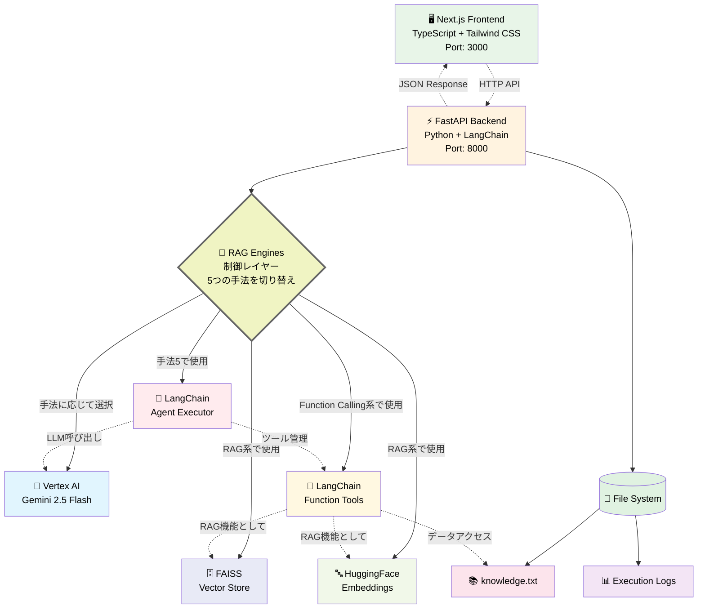
```mermaid
graph TD
    Frontend[🖥️ Next.js Frontend<br/>TypeScript + Tailwind CSS<br/>Port: 3000] 
    Backend[⚡ FastAPI Backend<br/>Python + LangChain<br/>Port: 8000]
    
    Frontend -.->|HTTP API| Backend
    Backend -.->|JSON Response| Frontend
    
    Backend --> Controller{🔄 RAG Engines<br/>制御レイヤー<br/>5つの手法を切り替え}
    
    Controller -->|手法に応じて選択| LLM[🤖 Vertex AI<br/>Gemini 2.5 Flash]
    Controller -->|RAG系で使用| Vector[🗄️ FAISS<br/>Vector Store]
    Controller -->|RAG系で使用| Embed[🔤 HuggingFace<br/>Embeddings]
    Controller -->|Function Calling系で使用| Tools[🔧 LangChain<br/>Function Tools]
    Controller -->|手法5で使用| Agent[🎯 LangChain<br/>Agent Executor]
    
    Tools -.->|RAG機能として| Vector
    Tools -.->|RAG機能として| Embed
    Agent -.->|ツール管理| Tools
    Agent -.->|LLM呼び出し| LLM
    
    Backend --> Storage[(📁 File System)]
    Storage --> KB[📚 knowledge.txt]
    Storage --> Logs[📊 Execution Logs]
    
    Tools -.->|データアクセス| KB
    
    style Frontend fill:#e8f5e8,color:#000
    style Backend fill:#fff3e0,color:#000
    style Controller fill:#f0f4c3,color:#000,stroke:#666,stroke-width:3px
    style LLM fill:#e1f5fe,color:#000
    style Vector fill:#e8eaf6,color:#000
    style Embed fill:#f1f8e9,color:#000
    style Tools fill:#fff8e1,color:#000
    style Agent fill:#ffebee,color:#000
    style KB fill:#fce4ec,color:#000
    style Logs fill:#f3e5f5,color:#000
    style Storage fill:#e0f2e1,color:#000
```

### 構成要素の説明

| 要素 | 役割 | 技術詳細 |
|------|------|----------|
| 🖥️ **Next.js Frontend** | ユーザーインターフェース | TypeScript + Tailwind CSS、レスポンシブデザイン |
| ⚡ **FastAPI Backend** | API サーバー | Python、LangChain統合、CORS対応 |
| 🔄 **RAG Engines（制御レイヤー）** | 手法切り替え制御 | 5つの情報提供パターンを統一的に管理・実行 |
| 🤖 **Vertex AI LLM** | 言語モデル | Google Gemini 2.5 Flash、テキスト生成 |
| 🗄️ **FAISS Vector Store** | ベクトルデータベース | 高速類似検索、文書の埋め込み保存 |
| 🔤 **HuggingFace Embeddings** | テキスト埋め込み | sentence-transformers、ベクトル変換 |
| 🔧 **Function Tools** | 動的ツール実行 | LangChainツール、Knowledge Base検索 |
| 🎯 **Agent Executor** | 複数ツール管理 | LangChainエージェント、戦略的実行 |
| 📚 **knowledge.txt** | ナレッジベース | 製品取扱説明書、共通データソース |
| 📊 **Execution Logs** | 実行ログ | JSONL形式、詳細な処理履歴 |

### 手法別システム構成図（静的な関係性）

各情報提供手法の静的な構成要素と関係性を可視化：

#### 手法1: LLM単体利用

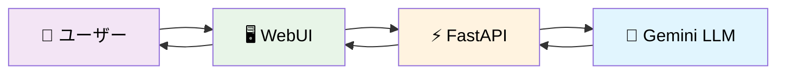
```mermaid
graph LR
    User[👤 ユーザー] --> UI[🖥️ WebUI]
    UI --> API[⚡ FastAPI]
    API --> LLM[🤖 Gemini LLM]
    LLM --> API
    API --> UI
    UI --> User
    
    style LLM fill:#e1f5fe,color:#000
    style User fill:#f3e5f5,color:#000
    style UI fill:#e8f5e8,color:#000
    style API fill:#fff3e0,color:#000
```

**特徴**: 最もシンプルな構成。外部情報源は一切使用せず、LLMの内蔵知識のみで回答を生成します。処理速度は最も高速ですが、知識の範囲が限定的です。

#### 手法2: プロンプトスタッフィング

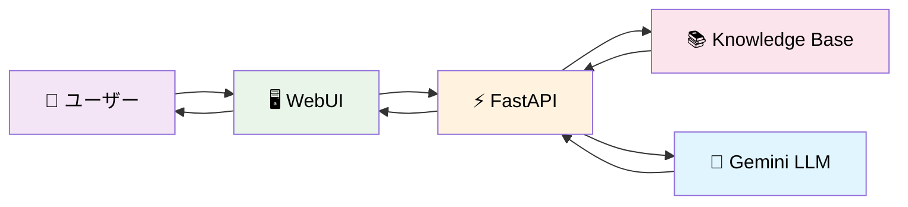
```mermaid
graph LR
    User[👤 ユーザー] --> UI[🖥️ WebUI]
    UI --> API[⚡ FastAPI]
    API --> KB[📚 Knowledge Base]
    KB --> API
    API --> LLM[🤖 Gemini LLM]
    LLM --> API
    API --> UI
    UI --> User
    
    style LLM fill:#e1f5fe,color:#000
    style KB fill:#fce4ec,color:#000
    style User fill:#f3e5f5,color:#000
    style UI fill:#e8f5e8,color:#000
    style API fill:#fff3e0,color:#000
```

**特徴**: Knowledge Baseから全データを読み込み、質問と一緒にプロンプトに埋め込みます。確実で理解しやすい手法ですが、データ量が多い場合はトークン消費量が大きくなります。

#### 手法3: RAGのみ

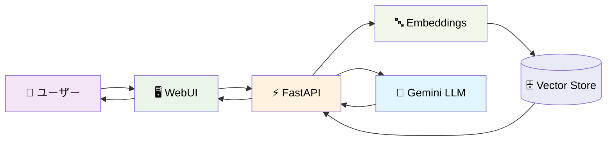
```mermaid
graph LR
    User[👤 ユーザー] --> UI[🖥️ WebUI]
    UI --> API[⚡ FastAPI]
    API --> Embed[🔤 Embeddings]
    Embed --> VectorDB[(🗄️ Vector Store)]
    VectorDB --> API
    API --> LLM[🤖 Gemini LLM]
    LLM --> API
    API --> UI
    UI --> User
    
    style LLM fill:#e1f5fe,color:#000
    style VectorDB fill:#e8eaf6,color:#000
    style Embed fill:#f1f8e9,color:#000
    style User fill:#f3e5f5,color:#000
    style UI fill:#e8f5e8,color:#000
    style API fill:#fff3e0,color:#000
```

**特徴**: 質問をEmbeddingsでベクトル化し、Vector Storeから関連性の高い文書を検索して回答に活用します。効率的で拡張性が高く、現代的なRAGの基本形です。

#### 手法4: Function Callingのみ

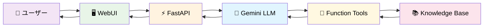
```mermaid
graph LR
    User[👤 ユーザー] --> UI[🖥️ WebUI]
    UI --> API[⚡ FastAPI]
    API --> LLM[🤖 Gemini LLM]
    LLM --> Tools[🔧 Function Tools]
    Tools --> KB[📚 Knowledge Base]
    KB --> Tools
    Tools --> LLM
    LLM --> API
    API --> UI
    UI --> User
    
    style LLM fill:#e1f5fe,color:#000
    style Tools fill:#fff8e1,color:#000
    style KB fill:#fce4ec,color:#000
    style User fill:#f3e5f5,color:#000
    style UI fill:#e8f5e8,color:#000
    style API fill:#fff3e0,color:#000
```

**特徴**: LLMが自律的にFunction Toolsを選択・実行してKnowledge Baseから必要な情報を取得します。LLMの判断力を活用した動的な情報検索が可能です。

#### 手法5: RAG + Function Calling（推奨）

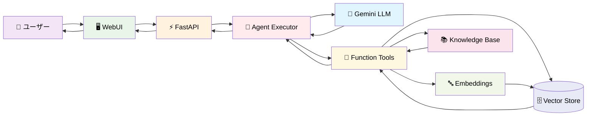
```mermaid
graph LR
    User[👤 ユーザー] --> UI[🖥️ WebUI]
    UI --> API[⚡ FastAPI]
    API --> Agent[🎯 Agent Executor]
    Agent --> LLM[🤖 Gemini LLM]
    LLM --> Agent
    Agent --> Tools[🔧 Function Tools]
    Tools --> Embed[🔤 Embeddings]
    Tools --> VectorDB[(🗄️ Vector Store)]
    Tools --> KB[📚 Knowledge Base]
    Embed --> VectorDB
    VectorDB --> Tools
    KB --> Tools
    Tools --> Agent
    Agent --> API
    API --> UI
    UI --> User
    
    style LLM fill:#e1f5fe,color:#000
    style Agent fill:#ffebee,color:#000
    style Tools fill:#fff8e1,color:#000
    style VectorDB fill:#e8eaf6,color:#000
    style Embed fill:#f1f8e9,color:#000
    style KB fill:#fce4ec,color:#000
    style User fill:#f3e5f5,color:#000
    style UI fill:#e8f5e8,color:#000
    style API fill:#fff3e0,color:#000
```

**特徴**: Agent ExecutorがLLMとFunction Toolsをオーケストレーションし、必要に応じてRAG検索（Embeddings + Vector Store）と直接的なKnowledge Base検索の両方を活用します。最も柔軟で高度な情報検索が可能な推奨手法です。

## 📊 手法別動的フロー（シーケンス図）

静的な構成図の理解に続いて、各手法の動的な処理フローをシーケンス図で説明します：

### 手法1シーケンス: LLM単体利用

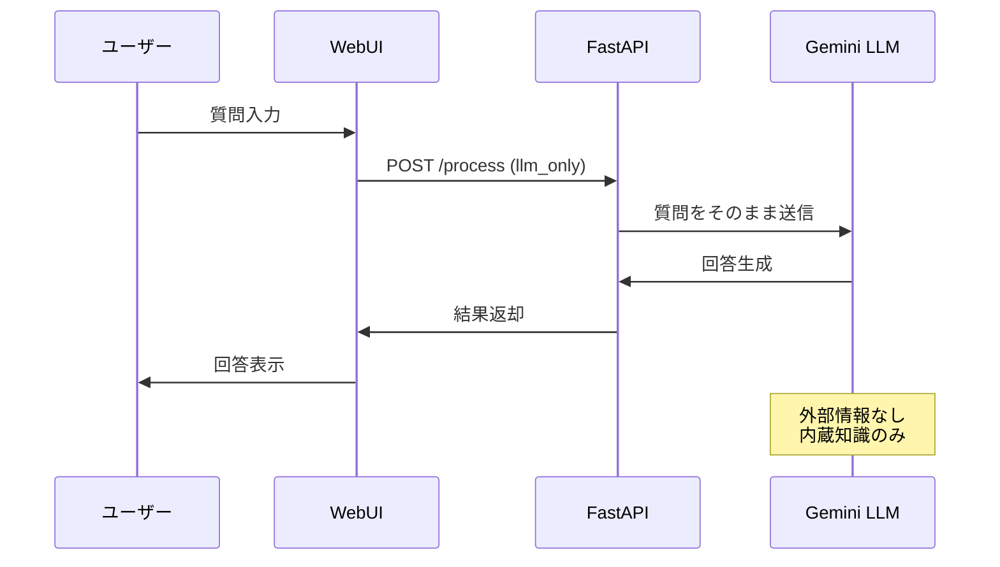
```mermaid
sequenceDiagram
    participant User as ユーザー
    participant UI as WebUI
    participant API as FastAPI
    participant LLM as Gemini LLM
    
    User->>UI: 質問入力
    UI->>API: POST /process (llm_only)
    API->>LLM: 質問をそのまま送信
    LLM->>API: 回答生成
    API->>UI: 結果返却
    UI->>User: 回答表示
    
    Note over LLM: 外部情報なし<br/>内蔵知識のみ
```

### 手法2シーケンス: プロンプトスタッフィング

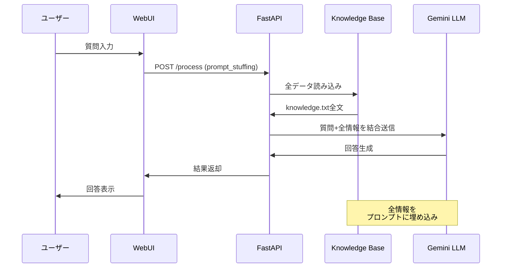
```mermaid
sequenceDiagram
    participant User as ユーザー
    participant UI as WebUI
    participant API as FastAPI
    participant KB as Knowledge Base
    participant LLM as Gemini LLM
    
    User->>UI: 質問入力
    UI->>API: POST /process (prompt_stuffing)
    API->>KB: 全データ読み込み
    KB->>API: knowledge.txt全文
    API->>LLM: 質問+全情報を結合送信
    LLM->>API: 回答生成
    API->>UI: 結果返却
    UI->>User: 回答表示
    
    Note over KB,LLM: 全情報を<br/>プロンプトに埋め込み
```

### 手法3シーケンス: RAGのみ

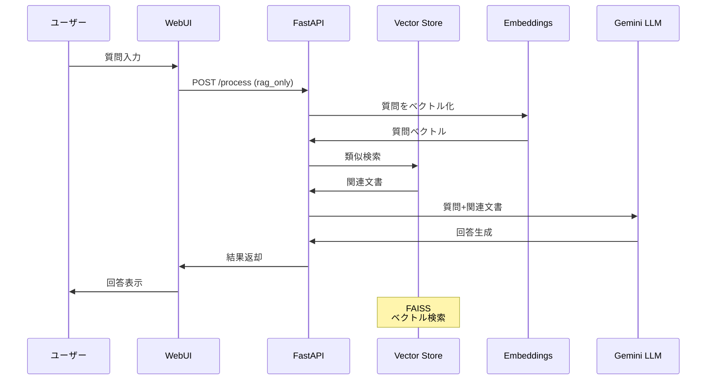
```mermaid
sequenceDiagram
    participant User as ユーザー
    participant UI as WebUI
    participant API as FastAPI
    participant VectorDB as Vector Store
    participant Embed as Embeddings
    participant LLM as Gemini LLM
    
    User->>UI: 質問入力
    UI->>API: POST /process (rag_only)
    API->>Embed: 質問をベクトル化
    Embed->>API: 質問ベクトル
    API->>VectorDB: 類似検索
    VectorDB->>API: 関連文書
    API->>LLM: 質問+関連文書
    LLM->>API: 回答生成
    API->>UI: 結果返却
    UI->>User: 回答表示
    
    Note over VectorDB: FAISS<br/>ベクトル検索
```

### 手法4シーケンス: Function Callingのみ

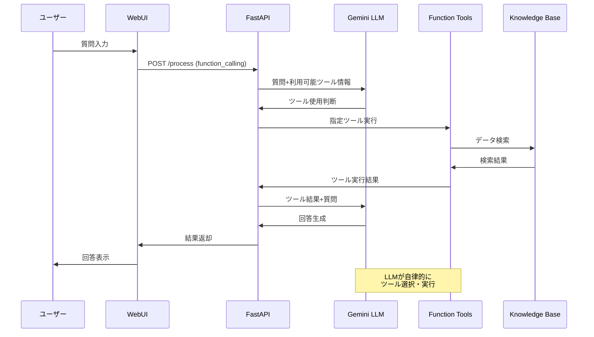
```mermaid
sequenceDiagram
    participant User as ユーザー
    participant UI as WebUI
    participant API as FastAPI
    participant LLM as Gemini LLM
    participant Tools as Function Tools
    participant KB as Knowledge Base
    
    User->>UI: 質問入力
    UI->>API: POST /process (function_calling)
    API->>LLM: 質問+利用可能ツール情報
    LLM->>API: ツール使用判断
    API->>Tools: 指定ツール実行
    Tools->>KB: データ検索
    KB->>Tools: 検索結果
    Tools->>API: ツール実行結果
    API->>LLM: ツール結果+質問
    LLM->>API: 回答生成
    API->>UI: 結果返却
    UI->>User: 回答表示
    
    Note over LLM,Tools: LLMが自律的に<br/>ツール選択・実行
```

### 手法5シーケンス: RAG + Function Calling

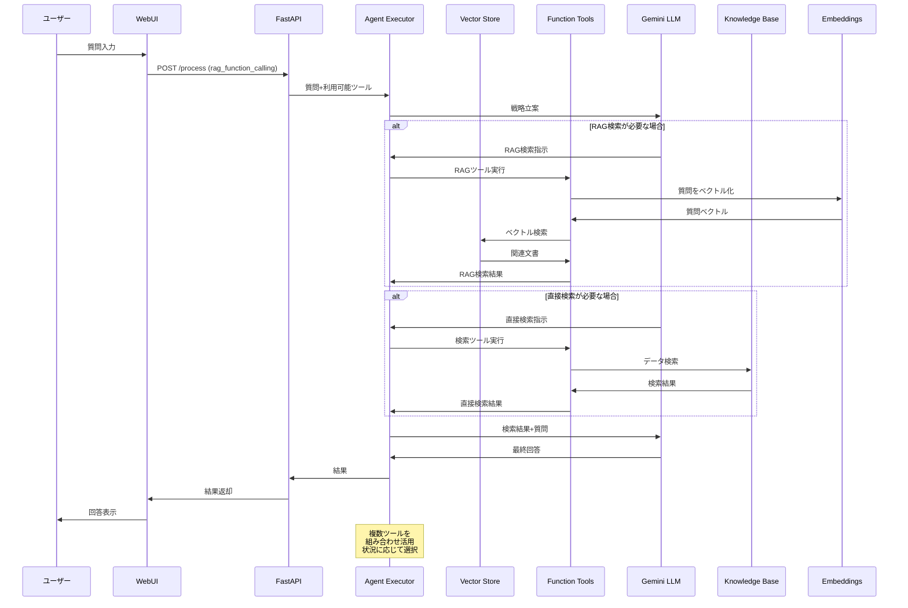
```mermaid
sequenceDiagram
    participant User as ユーザー
    participant UI as WebUI
    participant API as FastAPI
    participant Agent as Agent Executor
    participant VectorDB as Vector Store
    participant Tools as Function Tools
    participant LLM as Gemini LLM
    participant KB as Knowledge Base
    participant Embed as Embeddings
    
    User->>UI: 質問入力
    UI->>API: POST /process (rag_function_calling)
    API->>Agent: 質問+利用可能ツール
    Agent->>LLM: 戦略立案
    
    alt RAG検索が必要な場合
        LLM->>Agent: RAG検索指示
        Agent->>Tools: RAGツール実行
        Tools->>Embed: 質問をベクトル化
        Embed->>Tools: 質問ベクトル
        Tools->>VectorDB: ベクトル検索
        VectorDB->>Tools: 関連文書
        Tools->>Agent: RAG検索結果
    end
    
    alt 直接検索が必要な場合
        LLM->>Agent: 直接検索指示
        Agent->>Tools: 検索ツール実行
        Tools->>KB: データ検索
        KB->>Tools: 検索結果
        Tools->>Agent: 直接検索結果
    end
    
    Agent->>LLM: 検索結果+質問
    LLM->>Agent: 最終回答
    Agent->>API: 結果
    API->>UI: 結果返却
    UI->>User: 回答表示
    
    Note over Agent: 複数ツールを<br/>組み合わせ活用<br/>状況に応じて選択
```

## 🔍 手法比較表

| 要素 | 手法1 LLM単体 | 手法2 スタッフィング | 手法3 RAG | 手法4 Function Calling | 手法5 RAG+FC |
|------|:---:|:---:|:---:|:---:|:---:|
| **LLM** | ✅ | ✅ | ✅ | ✅ | ✅ |
| **Knowledge Base** | ❌ | ✅ | ✅ | ✅ | ✅ |
| **Vector Store** | ❌ | ❌ | ✅ | ❌ | ✅ |
| **Embeddings** | ❌ | ❌ | ✅ | ❌ | ✅ |
| **Function Tools** | ❌ | ❌ | ❌ | ✅ | ✅ |
| **Agent Executor** | ❌ | ❌ | ❌ | ❌ | ✅ |
| **自律判断** | ❌ | ❌ | ❌ | ✅ | ✅ |
| **効率性** | ⭐⭐⭐ | ⭐ | ⭐⭐⭐ | ⭐⭐ | ⭐⭐ |
| **精度** | ⭐ | ⭐⭐⭐ | ⭐⭐⭐ | ⭐⭐ | ⭐⭐⭐ |
| **柔軟性** | ⭐ | ⭐ | ⭐⭐ | ⭐⭐⭐ | ⭐⭐⭐ |

### 📝 評価指標の説明

#### 🤖 自律判断
**定義**: LLMが状況に応じて適切なツールや検索手法を自動選択する能力

- **❌ なし**: 事前に決められた処理のみ実行
- **✅ あり**: LLMが動的にツール選択・実行戦略を決定

**読み手の判断基準**: 
- **自律判断が重要な場合**: 多様な質問に対応、予期しない情報ニーズへの対応
- **自律判断が不要な場合**: 決まったパターンの質問、予測可能な処理フロー

#### ⚡ 効率性（処理速度・リソース消費）
**定義**: レスポンス時間とトークン消費量のバランス

- **⭐⭐⭐ 高**: 高速レスポンス、少ないトークン消費
- **⭐⭐ 中**: 中程度の処理時間、適度なリソース使用
- **⭐ 低**: 処理時間が長い、大量のトークン消費

**読み手の判断基準**:
- **高効率が重要**: リアルタイム応答、大量処理、コスト重視
- **効率性より精度**: 複雑な分析、高品質な回答が必要

#### 🎯 精度（回答の正確性・関連性）
**定義**: 質問に対する回答の正確性と情報の関連性

- **⭐⭐⭐ 高**: 外部情報を活用した正確で詳細な回答
- **⭐⭐ 中**: 関連情報は取得できるが、情報選択に課題
- **⭐ 低**: 限定的な知識による曖昧または不正確な回答

**読み手の判断基準**:
- **高精度が必要**: 専門的な質問、事実確認、正確性が重要な業務
- **精度より速度**: 概要把握、ブレインストーミング、一般的な質問

#### 🔧 柔軟性（適応性・拡張性）
**定義**: 多様な質問や新しい要求に対する対応能力

- **⭐⭐⭐ 高**: 複数の検索手法、動的な戦略変更、多様な情報源に対応
- **⭐⭐ 中**: 限定的だが複数の情報取得手法を利用
- **⭐ 低**: 固定的な処理、単一の情報源に依存

**読み手の判断基準**:
- **高柔軟性が重要**: 多様な業務、予期しない質問、将来の拡張性
- **柔軟性より安定性**: 定型的な業務、予測可能な質問パターン

### 💡 手法選択のガイドライン

| 用途・要件 | 推奨手法 | 理由 |
|------------|----------|------|
| **プロトタイプ・検証** | 手法1 LLM単体 | 最速実装、基本性能確認 |
| **小規模データ・確実性重視** | 手法2 スタッフィング | シンプル、確実、理解しやすい |
| **大規模データ・効率重視** | 手法3 RAG | 高効率、拡張性、現代的手法 |
| **動的・多様な要求** | 手法4 Function Calling | 柔軟性、自律性、カスタマイズ性 |
| **本格運用・最高品質** | 手法5 RAG+FC | 総合力、実用性、将来性 |

## 🔧 技術詳細

### 使用技術

#### バックエンド

- **フレームワーク**: FastAPI
- **LLM**: Google Vertex AI (gemini-2.5-flash)
- **RAGライブラリ**: LangChain
- **ベクトル検索**: FAISS
- **埋め込みモデル**: sentence-transformers/all-MiniLM-L6-v2
- **エージェント**: LangChain AgentExecutor
- **ログ**: structlog

#### フロントエンド

- **フレームワーク**: Next.js 15 (React 19)
- **スタイリング**: Tailwind CSS
- **HTTP通信**: Axios
- **UI**: Lucide React Icons
- **通知**: React Hot Toast
- **言語**: TypeScript

### プロジェクト構成

```bash
rag-sample-codes/
├── .gitignore                       # Git除外設定
├── LICENSE                          # MITライセンス
├── README.md                        # このファイル
├── data/
│   └── knowledge.txt               # 製品取扱説明書（共通データ）
├── logs/                           # 実行ログファイル保存先
├── src/
│   ├── backend/                    # Python FastAPI バックエンド
│   │   ├── main.py                # FastAPI アプリケーション本体
│   │   ├── rag_engines.py         # 5つのRAGエンジン実装
│   │   ├── logger_config.py       # ログ設定
│   │   ├── requirements.txt       # Python依存パッケージ
│   │   ├── run_llm_only.py       # 既存実装1: LLM単体利用
│   │   ├── run_prompt_stuffing.py # 既存実装2: プロンプトスタッフィング
│   │   ├── run_rag_only.py        # 既存実装3: RAGのみ
│   │   ├── run_function_calling_only.py # 既存実装4: Function Calling
│   │   └── run_rag_plus_fancall.py # 既存実装5: RAG + Function Calling
│   └── frontend/                   # Next.js フロントエンド
│       ├── src/app/page.tsx       # メインUI
│       ├── package.json           # Node.js依存パッケージ
│       └── ... (その他Next.jsファイル)
└── .venv/                          # Python仮想環境
```

### Webアプリケーション機能

- **直感的なUI**: モダンなレスポンシブWebインターフェース
- **モード切替**: 5つの情報提供手法を簡単に切り替え可能
- **リアルタイム実行ステータス**: 処理の進行状況と中間生成物を表示
- **デモモード**: プレゼンテーション用の遅延表示機能
- **トークン使用量表示**: 入力・出力・総トークン数の詳細表示
- **ナレッジベース編集**: ブラウザ上でknowledge.txtを直接編集可能
- **実行ログ**: JSONL形式での詳細ログ自動生成・ダウンロード機能

### 各手法の実装詳細

#### 1. LLM単体利用

- **目的**: 外部情報を一切与えなかった場合のベースライン確認
- **特徴**: 純粋なLLMの知識のみで回答
- **モデル**: gemini-2.5-flash

#### 2. プロンプトスタッフィング

- **目的**: LLMのコンテキストウィンドウを活用した全情報埋め込み
- **特徴**: knowledge.txtの全内容をプロンプトに含める
- **利点**: シンプルで確実
- **欠点**: トークン消費量が多い

#### 3. RAGのみ

- **目的**: 現代的なRAGアーキテクチャの基本形
- **特徴**:
  - ベクトル検索による関連情報の取得
  - FAISS + HuggingFace Embeddings
  - LCELチェーンによる処理
- **利点**: 効率的で拡張性が高い

#### 4. Function Callingのみ

- **目的**: LLMの自律的ツール利用能力の検証
- **特徴**:
  - `@tool`デコレーターによるツール定義
  - LLMの自律的なツール選択
- **利点**: 柔軟で動的な情報取得

#### 5. RAG + Function Calling ⭐推奨⭐

- **目的**: RAG検索とツール利用の組み合わせによる最高度な構成
- **特徴**:
  - AgentExecutorによる複数ツールの管理
  - RAGをツール化した高度な検索
  - verbose=Trueで思考プロセスが見える
- **利点**: 最も柔軟で実用的

## 📚 用語集（RAG・LLM関連）

### 基本概念

**RAG（Retrieval-Augmented Generation）**
検索拡張生成。外部知識ベースから関連情報を検索し、その情報を元にLLMが回答を生成する手法。LLMの知識の制約を補い、最新情報や特定ドメインの情報を活用できる。

**LLM（Large Language Model）**
大規模言語モデル。GPT、Gemini、Claude等の汎用的な言語理解・生成能力を持つAIモデル。

**Vector Store（ベクトルストア）**
文書をベクトル形式で保存し、高速な類似検索を可能にするデータベース。Chroma、Pinecone、Weaviate等がある。

**Embedding（埋め込み）**
テキストを数値ベクトルに変換する処理。類似した意味の文書は近いベクトル値を持つため、意味検索が可能になる。

### 検索・取得関連

**Similarity Search（類似検索）**
クエリと最も類似したベクトルを持つ文書を検索する手法。コサイン類似度やユークリッド距離等で計算される。

**Hybrid Search（ハイブリッド検索）**
ベクトル検索（意味的類似性）とキーワード検索（語彙的一致）を組み合わせた検索手法。より精度の高い検索結果を得られる。

**Retrieval（検索・取得）**
クエリに関連する文書やチャンクを知識ベースから取得するプロセス。RAGの「R」に相当する。

**Top-K Retrieval**
類似度が高い上位K件の文書を取得する手法。Kの値により検索範囲と精度のバランスを調整する。

### 文書処理関連

**Chunking（チャンク分割）**
長い文書を小さな単位（チャンク）に分割する処理。LLMのコンテキスト制限に対応し、検索精度を向上させる。

**Chunk Size（チャンクサイズ）**
各チャンクに含める文字数やトークン数。小さすぎると文脈が失われ、大きすぎると検索精度が低下する。

**Chunk Overlap（チャンクオーバーラップ）**
隣接するチャンク間で重複させる文字数。文脈の切断を防ぎ、検索精度を向上させる。

**Document Splitting（文書分割）**
文書をセクション、段落、文などの意味的単位で分割する処理。単純な文字数分割より精度が高い。

### プロンプト・生成関連

**Prompt Template（プロンプトテンプレート）**
LLMへの指示を定型化したテンプレート。一貫性のある出力を得るために使用される。

**Prompt Stuffing（プロンプト詰め込み）**
関連文書をすべてプロンプトに含めてLLMに送信する手法。シンプルだがトークン制限に注意が必要。

**Context Window（コンテキストウィンドウ）**
LLMが一度に処理できるトークンの最大数。モデルによって異なり、長い文書の処理能力に影響する。

**Token（トークン）**
LLMが処理する最小単位。通常、単語の一部から数単語程度。日本語では1文字あたり2-3トークン程度。

### 機能・モード関連

**Function Calling（関数呼び出し）**
LLMが外部の関数やAPIを呼び出して動的に情報を取得・処理する機能。

**Grounding（グラウンディング）**
LLMの回答を外部の事実に基づかせること。RAGはグラウンディングの一種。

**Hallucination（幻覚）**
LLMが事実に基づかない内容を生成すること。RAGにより軽減できる。

### 評価・パフォーマンス関連

**Relevance（関連性）**
検索結果がクエリにどの程度関連しているかの指標。RAGシステムの重要な評価軸。

**Precision（精密度）**
検索結果のうち実際に関連性の高い文書の割合。

**Recall（再現率）**
関連する全文書のうち実際に検索で取得できた文書の割合。

**Latency（レイテンシ）**
クエリから回答までの応答時間。ユーザー体験に直結する重要な指標。

### 技術実装関連

**Vector Database（ベクトルデータベース）**
高次元ベクトルの保存・検索に特化したデータベース。ANN（近似最近傍）検索を高速実行する。

**Semantic Search（意味検索）**
単語の表面的な一致ではなく、意味的な類似性に基づく検索。埋め込みベクトルを利用する。

**Reranking（再ランキング）**
初期検索結果をより精密なモデルで再評価・並び替えする手法。検索精度をさらに向上させる。

**Metadata Filtering（メタデータフィルタリング）**
日付、カテゴリ、作成者等のメタデータを使って検索対象を事前に絞り込む手法。

## 📋 事前準備: Google Cloud AI API設定

このシステムを動作させるには、Google Cloud ProjectでVertex AI APIを設定する必要があります。以下のWebUI中心の手順で、初心者でも安心して設定できます。

> **💡 設定の全体像**  
> この設定は「AIアプリケーションの家を建てて、電気・水道を通し、プログラムが入居できるように身分証明書を作る」というイメージです。

### ステップ1: プロジェクトの作成と有効化

> **🏠 目的**: これから作るAIアプリケーションの「家」と「住所」を決め、電気や水道（API）を使えるようにする作業です。

#### 1-1. Google Cloudにログイン
[Google Cloud Console](https://console.cloud.google.com/)に、お持ちのGoogleアカウントでログインします。

#### 1-2. プロジェクトを作成する
1. 画面左上のプロジェクト名が表示されている部分（例: `My First Project`）をクリック
2. 「新しいプロジェクト」を選択
3. プロジェクト名に分かりやすい名前（例: `My RAG Project`）を入力
4. 「作成」をクリック
5. **重要**: 作成されたプロジェクトIDをメモしてください

> **❓ なぜプロジェクトが必要？**  
> プロジェクトは、リソースや課金を管理するための独立した「箱」です。この箱を作ることで、他のプロジェクトと完全に分離して開発を進められます。

#### 1-3. 請求を有効化する
1. 左のナビゲーションメニュー（☰）から「お支払い」を選択
2. 画面の指示に従ってクレジットカード情報などを登録
3. 「請求先アカウント」を作成・リンク

> **💰 請求について**  
> API利用は従量課金制のため、支払い情報の登録が必須です。ただし、多くの場合、個人の学習範囲であれば無料利用枠内に収まります。

#### 1-4. Vertex AI APIを有効にする
1. ナビゲーションメニュー（☰）から「APIとサービス」→「ライブラリ」を選択
2. 検索バーに「Vertex AI API」と入力
3. 表示されたAPIをクリックして「有効にする」ボタンをクリック

> **🔐 なぜ有効化が必要？**  
> セキュリティのため、Google CloudのAPIはデフォルトでオフになっています。「このプロジェクトでGeminiを使います」という意思表示として、明示的にオンにする必要があります。

### ステップ2: 認証キー（サービスアカウントキー）の作成

> **🔑 目的**: あなたのプログラムが、許可された利用者であることを証明するための「身分証明書」と「鍵」を作成します。

#### 2-1. サービスアカウントを作成する
1. ナビゲーションメニュー（☰）から「IAMと管理」→「サービスアカウント」を選択
2. 「+ サービスアカウントを作成」をクリック
3. 分かりやすい名前（例: `gemini-rag-runner`）を付けて「作成して続行」

> **🤖 サービスアカウントとは？**  
> サービスアカウントは、人間ではなく、プログラム専用の特別なGoogleアカウントです。このアカウントに権限を与えることで、安全にAPIを利用します。

#### 2-2. 役割（権限）を付与する
1. 「ロールを選択」で「Vertex AI ユーザー」を検索して選択
2. 「続行」→「完了」と進む

> **🛡️ 最小権限の原則**  
> 作成したプログラム用アカウントに、「あなたはVertex AIを使っても良いですよ」という権限を与えることで、必要最小限の権限で安全に運用できます。

#### 2-3. JSONキーをダウンロードする
1. 作成したサービスアカウントの一覧から、今作ったアカウントのメールアドレスをクリック
2. 「キー」タブに移動
3. 「鍵を追加」→「新しい鍵を作成」を選択
4. キーのタイプは「JSON」のまま「作成」をクリック
5. 自動的にJSONファイルがPCにダウンロードされます

> **🔐 秘密鍵の重要性**  
> このJSONファイルが、プログラムがGoogleに自分を証明するための「秘密の鍵」です。これを持っているプログラムだけが、APIを呼び出すことができます。

### ステップ3: PC環境の設定

> **⚙️ 目的**: あなたのPC上で動くプログラムに、「鍵」のありかを教えます。

#### 3-1. キーファイルを安全な場所に配置

1. ダウンロードしたJSONキーファイルを、このプロジェクトのルートフォルダに移動
2. ファイル名を分かりやすい名前（例: `service-account-key.json`）に変更（任意）

> **📁 推奨配置場所**  
> プロジェクトルートに配置することで、相対パスで指定でき、チーム開発時の設定が統一しやすくなります。

#### 3-2. 環境変数を設定する

プロジェクトルートに`.env`ファイルを作成し、以下の内容を記載：

```bash
# 必須設定
GOOGLE_CLOUD_PROJECT=your-actual-project-id
GOOGLE_APPLICATION_CREDENTIALS=./service-account-key.json
GOOGLE_CLOUD_REGION=us-central1

# オプション設定
CHUNK_SIZE=800
CHUNK_OVERLAP=150
MAX_RETRIEVED_DOCS=5
```

> **🔧 環境変数設定の代替方法**  
> `.env`ファイルの代わりに、ターミナルで直接設定することも可能です：

**Windows PowerShell:**
```powershell
$env:GOOGLE_CLOUD_PROJECT = "your-project-id"
$env:GOOGLE_APPLICATION_CREDENTIALS = ".\service-account-key.json"
```

**macOS/Linux:**
```bash
export GOOGLE_CLOUD_PROJECT="your-project-id"
export GOOGLE_APPLICATION_CREDENTIALS="./service-account-key.json"
```

> **💡 なぜ環境変数が必要？**  
> LangChainなどのライブラリは、`GOOGLE_APPLICATION_CREDENTIALS`という決まった名前の環境変数を自動で探しに行きます。ここにパスを設定しておけば、コード内に秘密の鍵情報を書かずに済み、安全です。

#### 3-3. 設定確認

以下のPythonスクリプトで設定が正しいかテストできます：

```python
import os
from google.cloud import aiplatform

# 環境変数の確認
project_id = os.getenv('GOOGLE_CLOUD_PROJECT')
credentials_path = os.getenv('GOOGLE_APPLICATION_CREDENTIALS')

print(f"プロジェクトID: {project_id}")
print(f"認証ファイル: {credentials_path}")

# Vertex AI接続テスト
try:
    aiplatform.init(project=project_id, location="us-central1")
    print("✅ Vertex AI接続成功！")
except Exception as e:
    print(f"❌ 接続エラー: {e}")
```

### 🎯 設定完了後の次のステップ

Google Cloud AI APIの設定が完了したら、以下の手順でシステムを起動できます：

1. **� クイックスタート** セクションに戻って実行する
2. または **� インストール・実行手順** セクションで詳細な手順を確認する
3. 問題が発生した場合は **🔧 トラブルシューティング** を参照

> **🎉 お疲れ様でした！**  
> これで、LLMを活用したRAGシステムを体験する準備が整いました。**[🚀 クイックスタート](#🚀-クイックスタート)** に戻って、実際にシステムを起動して、5つの異なる情報提供手法を比較してみましょう。

---

## 🚀 インストール・実行手順

### 初回セットアップ（初めて実行する場合）

#### 1. 前提条件の確認

- Python 3.10以上
- Node.js 18以上
- Git

#### 2. プロジェクトのクローン

```bash
git clone <repository-url>
cd rag-sample-codes
```

#### 3. バックエンド環境構築

```bash
# Python仮想環境作成・有効化
python -m venv .venv

# Windows
.venv\Scripts\activate

# Linux/Mac
source .venv/bin/activate

# 依存関係インストール
pip install -r src/backend/requirements.txt
```

#### 4. フロントエンド環境構築

```bash
cd src/frontend
npm install
cd ../..
```

#### 5. 環境変数設定

前述の「事前準備」で設定した`.env`ファイルがプロジェクトルートにあることを確認。

#### 6. 初回実行テスト

```bash
# ターミナル1: バックエンド起動
python src/backend/main.py

# ターミナル2: フロントエンド起動（新しいターミナルで）
cd src/frontend
npm run dev
```

#### 7. 動作確認

- **フロントエンド**: http://localhost:3000
- **バックエンドAPI**: http://localhost:8000
- **API仕様書**: http://localhost:8000/docs

### 通常実行（2回目以降）

一度環境構築が完了していれば、以下の手順で簡単に起動できます：

#### 方法1: 手動起動

```bash
# 1. Python仮想環境を有効化
.venv\Scripts\activate  # Windows
# source .venv/bin/activate  # Linux/Mac

# 2. バックエンド起動（ターミナル1）
python src/backend/main.py

# 3. フロントエンド起動（ターミナル2）
cd src/frontend
npm run dev
```

#### 方法2: 一括起動スクリプト（推奨）

**Windows用 `start.bat`:**
```batch
@echo off
echo RAG Sample System Starting...

:: バックエンド起動
start "Backend" cmd /k ".venv\Scripts\activate && python src/backend/main.py"

:: フロントエンド起動
start "Frontend" cmd /k "cd src/frontend && npm run dev"

echo システムを起動しています...
echo バックエンド: http://localhost:8000
echo フロントエンド: http://localhost:3000
pause
```

**Linux/Mac用 `start.sh`:**
```bash
#!/bin/bash
echo "RAG Sample System Starting..."

# バックエンド起動
source .venv/bin/activate
python src/backend/main.py &

# フロントエンド起動
cd src/frontend
npm run dev &

echo "システムを起動しています..."
echo "バックエンド: http://localhost:8000"
echo "フロントエンド: http://localhost:3000"
```

## 📊 ログフォーマット

実行ログは`logs/`フォルダに`YYYYMMDDHHMMSS_llm-rag-exp.jsonl`形式で保存されます：

```json
{
  "timestamp": "2025-07-02T15:30:45.123456",
  "execution_mode": "rag_function_calling",
  "query": "エラーコードE-404の対処法は？",
  "response": "...",
  "input_tokens": 150,
  "output_tokens": 200,
  "total_tokens": 350,
  "execution_time": 3.45,
  "intermediate_steps": [...],
  "demo_mode": false
}
```

## Google Cloud & LLM 接続トラブルシューティング

<details>
<summary>🔧 <strong>Google Cloud関連のエラーと解決方法</strong>（クリックして展開）</summary>

### よくある接続エラーと対処法

#### 認証関連のエラー

**エラー: `google.auth.exceptions.DefaultCredentialsError`**
```
google.auth.exceptions.DefaultCredentialsError: Could not automatically determine credentials.
```

**原因と対処法:**
- `GOOGLE_APPLICATION_CREDENTIALS`環境変数が設定されていない
- サービスアカウントキーファイルのパスが間違っている

```bash
# 環境変数を確認
echo $env:GOOGLE_APPLICATION_CREDENTIALS  # Windows PowerShell
echo $GOOGLE_APPLICATION_CREDENTIALS     # Linux/Mac

# 正しく設定
$env:GOOGLE_APPLICATION_CREDENTIALS="C:\path\to\service-account-key.json"
```

**エラー: `google.auth.exceptions.RefreshError`**
```
google.auth.exceptions.RefreshError: The credentials do not contain the necessary fields.
```

**原因と対処法:**
- サービスアカウントキーファイルの形式が不正
- キーファイルが破損している
- 権限が不足している

```bash
# キーファイルの内容を確認（JSONとして有効かチェック）
python -c "import json; print(json.load(open('path/to/key.json'))['type'])"

# 新しいキーを生成し直す
gcloud iam service-accounts keys create new-key.json --iam-account=your-service-account@project.iam.gserviceaccount.com
```

#### プロジェクト設定関連のエラー

**エラー: `google.api_core.exceptions.PermissionDenied`**
```
google.api_core.exceptions.PermissionDenied: 403 Permission denied on resource project my-project.
```

**原因と対処法:**
- プロジェクトIDが間違っている
- Vertex AI APIが有効化されていない
- サービスアカウントに必要な権限がない

```bash
# プロジェクトIDを確認
gcloud config get-value project

# Vertex AI APIを有効化
gcloud services enable aiplatform.googleapis.com

# 必要な権限を追加
gcloud projects add-iam-policy-binding PROJECT_ID \
    --member="serviceAccount:your-service-account@PROJECT_ID.iam.gserviceaccount.com" \
    --role="roles/aiplatform.user"
```

#### リージョン関連のエラー

**エラー: `google.api_core.exceptions.NotFound`**
```
google.api_core.exceptions.NotFound: 404 Location us-central1-a is not found or access is denied.
```

**原因と対処法:**
- 指定したリージョンでVertex AIが利用できない
- リージョン名が間違っている

```python
# 利用可能なリージョンを確認
SUPPORTED_REGIONS = [
    "us-central1",
    "us-east1", 
    "us-west1",
    "europe-west1",
    "asia-northeast1"
]

# 環境変数でリージョンを指定
export GOOGLE_CLOUD_REGION="us-central1"
```

#### モデル関連のエラー

**エラー: `google.api_core.exceptions.InvalidArgument`**
```
google.api_core.exceptions.InvalidArgument: 400 Model gemini-pro-vision does not exist.
```

**原因と対処法:**
- モデル名が間違っている
- 指定したリージョンでモデルが利用できない

```python
# 利用可能なモデルを確認
AVAILABLE_MODELS = {
    "gemini-1.5-pro": "最新の高性能モデル",
    "gemini-1.5-flash": "高速レスポンスモデル", 
    "gemini-pro": "汎用モデル"
}

# モデル名を修正
model_name = "gemini-1.5-pro"  # 正しいモデル名
```

#### ネットワーク関連のエラー

**エラー: `requests.exceptions.ConnectionError`**
```
requests.exceptions.ConnectionError: HTTPSConnectionPool(host='aiplatform.googleapis.com', port=443)
```

**原因と対処法:**
- インターネット接続の問題
- プロキシ設定の問題
- ファイアウォールによるブロック

```bash
# 接続確認
curl -I https://aiplatform.googleapis.com

# プロキシ設定（必要に応じて）
export HTTPS_PROXY=http://proxy.company.com:8080
export HTTP_PROXY=http://proxy.company.com:8080
```

#### 料金・クォータ関連のエラー

**エラー: `google.api_core.exceptions.ResourceExhausted`**
```
google.api_core.exceptions.ResourceExhausted: 429 Quota exceeded for quota metric 'aiplatform.googleapis.com/requests' 
```

**原因と対処法:**
- API呼び出し回数の上限に達した
- 課金が停止している

```bash
# クォータ使用量を確認
gcloud monitoring metrics list --filter="aiplatform.googleapis.com"

# 課金アカウントを確認
gcloud billing accounts list
gcloud billing projects describe PROJECT_ID
```

### デバッグ用の設定

#### 詳細ログの有効化

```python
import logging
import google.auth
from google.auth.transport.requests import Request

# 詳細ログを有効化
logging.basicConfig(level=logging.DEBUG)
logger = logging.getLogger('google.auth')
logger.setLevel(logging.DEBUG)

# 認証情報の確認
credentials, project = google.auth.default()
credentials.refresh(Request())
print(f"Project: {project}")
print(f"Token valid: {credentials.valid}")
```

#### 環境変数の確認スクリプト

```python
import os
import json
from pathlib import Path

def check_environment():
    """環境設定を確認するデバッグ関数"""
    
    # 必須環境変数をチェック
    required_vars = [
        "GOOGLE_CLOUD_PROJECT",
        "GOOGLE_APPLICATION_CREDENTIALS"
    ]
    
    print("=== 環境変数確認 ===")
    for var in required_vars:
        value = os.getenv(var)
        if value:
            print(f"✅ {var}: {value}")
            
            # サービスアカウントキーファイルの確認
            if var == "GOOGLE_APPLICATION_CREDENTIALS":
                if Path(value).exists():
                    try:
                        with open(value) as f:
                            key_data = json.load(f)
                        print(f"   📋 Type: {key_data.get('type')}")
                        print(f"   📋 Project: {key_data.get('project_id')}")
                        print(f"   📋 Client Email: {key_data.get('client_email')}")
                    except Exception as e:
                        print(f"   ❌ キーファイル読み込みエラー: {e}")
                else:
                    print(f"   ❌ ファイルが存在しません: {value}")
        else:
            print(f"❌ {var}: 未設定")
    
    # Vertex AI利用可能性チェック
    print("\n=== Vertex AI接続確認 ===")
    try:
        from google.cloud import aiplatform
        aiplatform.init(project=os.getenv("GOOGLE_CLOUD_PROJECT"))
        print("✅ Vertex AI初期化成功")
    except Exception as e:
        print(f"❌ Vertex AI初期化失敗: {e}")

if __name__ == "__main__":
    check_environment()
```

#### 段階的な接続テスト

```python
def test_connection_step_by_step():
    """段階的に接続をテストする関数"""
    
    # Step 1: 基本認証
    print("Step 1: 基本認証テスト")
    try:
        import google.auth
        credentials, project = google.auth.default()
        print(f"✅ 認証成功 - Project: {project}")
    except Exception as e:
        print(f"❌ 認証失敗: {e}")
        return
    
    # Step 2: Vertex AI初期化
    print("\nStep 2: Vertex AI初期化テスト")
    try:
        from google.cloud import aiplatform
        aiplatform.init(project=project, location="us-central1")
        print("✅ Vertex AI初期化成功")
    except Exception as e:
        print(f"❌ Vertex AI初期化失敗: {e}")
        return
    
    # Step 3: モデル接続テスト
    print("\nStep 3: モデル接続テスト")
    try:
        model = aiplatform.gapic.PredictionServiceClient()
        print("✅ モデルクライアント作成成功")
    except Exception as e:
        print(f"❌ モデル接続失敗: {e}")
        return
    
    print("\n🎉 全ての接続テストが成功しました")

if __name__ == "__main__":
    test_connection_step_by_step()
```

</details>

## 🔗 関連ドキュメント

- **[RAG実装ベストプラクティスガイド](./rag_best_practice.md)** - 実装時のベストプラクティス、エラーハンドリング、セキュリティ対策、パフォーマンス最適化などの詳細なガイド

---

**重要**: このプロジェクトを実行するには、Google Cloud ProjectでのVertex AI API有効化と適切な認証設定が必要です。上記のクイックスタートガイドに従って設定を行ってください。
