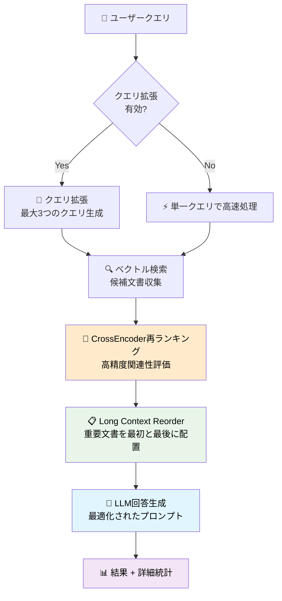
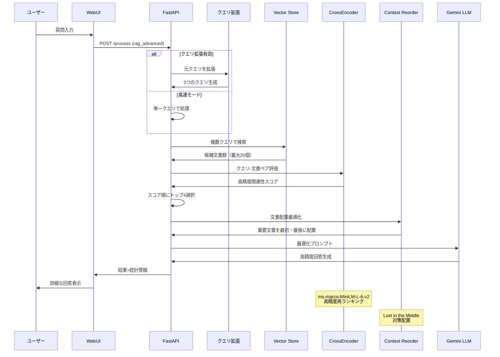

# LLM情報提供手法比較システム

このプロジェクトは、LLMに外部情報を与えるための**5つの主要手法を統一環境で比較・検証**できる**フルスタックWebアプリケーション**です。

## 🎯 背景と目的

現代のLLMアプリケーション開発において、外部情報の提供方法は成功の鍵となります。本システムでは以下の5つの主要アプローチを実装し、同一条件での比較を可能にしています：

1. **LLM単体利用**: ベースライン確認
2. **プロンプトスタッフィング**: 全情報埋め込み
3. **RAGのみ**: ベクトル検索による効率的検索
4. **Function Calling**: LLMの自律的ツール利用
5. **RAG + Function Calling**: 複合アプローチ（推奨）

各手法の**効率性・精度・柔軟性**を定量的・定性的に比較し、実用的な知見を得ることができます。

## ✨ 主な特徴

- **統一環境での比較**: 同一データ・同一質問での公正な比較
- **フルスタックWebアプリ**: PythonのFastAPIバックエンド + Next.jsフロントエンド
- **リアルタイム処理**: 処理状況・中間生成物をリアルタイム表示
- **詳細な分析機能**: トークン数・処理時間・実行ログの詳細表示
- **デモモード**: プレゼンテーション用の遅延表示機能
- **編集可能KB**: ブラウザ上でナレッジベースを直接編集可能

## 🚀 クイックスタート

### 前提条件

- Python 3.10以上
- Node.js 18以上
- Google Cloud Project（Vertex AI API有効化）

## 🚀 クイックスタート

### 前提条件

- Python 3.10以上
- Node.js 18以上
- Google Cloud Project（Vertex AI API有効化）

### 📋 最短設定手順

> **⚠️ 重要**: Google Cloud APIの設定が必要です。詳細な手順は **[📋 事前準備: Google Cloud AI API設定](#📋-事前準備-google-cloud-ai-api設定)** をご覧ください。

#### 1. Google Cloud設定（必須）
- [Google Cloud Console](https://console.cloud.google.com/)でプロジェクト作成
- Vertex AI APIを有効化
- サービスアカウントキーをダウンロード

#### 2. 認証設定（必須）
プロジェクトルートに`.env`ファイルを作成し、以下を記載：

```bash
GOOGLE_CLOUD_PROJECT=your-actual-project-id
GOOGLE_APPLICATION_CREDENTIALS=./service-account-key.json
```

> **💡 設定のポイント**  
> - `GOOGLE_CLOUD_PROJECT`: 作成したプロジェクトのID
> - `GOOGLE_APPLICATION_CREDENTIALS`: ダウンロードしたJSONキーファイルのパス
> - 詳細な設定方法は **[事前準備セクション](#📋-事前準備-google-cloud-ai-api設定)** で説明しています

### 🔧 インストール・実行

#### 初回セットアップ（初めて実行する場合）

```bash
# 1. プロジェクトをクローン（GitHubから取得した場合）
git clone <repository-url>
cd rag-sample-codes

# 2. 認証設定（必須）
# プロジェクトルートに.envファイルを作成し、上記の内容を記載

# 3. バックエンド環境構築
python -m venv .venv
.venv\Scripts\activate  # Windows
# source .venv/bin/activate  # Linux/Mac
pip install -r src/backend/requirements.txt

# 4. フロントエンド環境構築
cd src/frontend
npm install
cd ..

# 5. 初回実行テスト
# ターミナル1: バックエンド起動
python src/backend/main.py

# ターミナル2: フロントエンド起動（新しいターミナルで）
cd src/frontend
npm run dev
```

#### 通常実行（2回目以降）

一度環境構築が完了していれば、以下の簡単な手順で起動できます：

```bash
# 1. Python仮想環境を有効化
.venv\Scripts\activate  # Windows
# source .venv/bin/activate  # Linux/Mac

# 2. バックエンド起動（ターミナル1）
python src/backend/main.py

# 3. フロントエンド起動（ターミナル2）
cd src/frontend
npm run dev
```

> **🚀 一括起動スクリプト**  
> 毎回の起動を簡単にするため、詳細な **[インストール・実行手順](#🚀-インストール・実行手順)** では一括起動スクリプトも紹介しています。

### 🌐 アクセス

システムが正常に起動したら、以下のURLでアクセスできます：

- **フロントエンド**: <http://localhost:3000>
- **バックエンドAPI**: <http://localhost:8000>
- **API仕様書**: <http://localhost:8000/docs>

### 📖 基本的な使用方法

1. ブラウザで <http://localhost:3000> にアクセス
2. 処理モードを選択（5つの手法から）
3. 質問を入力（例: 「エラーコードE-404の対処法は？」）
4. 「送信」ボタンをクリック
5. リアルタイムで処理状況・結果・トークン数を確認
6. 必要に応じてナレッジベースを編集
7. 実行ログをダウンロード

> **🔗 詳細な設定情報**  
> より詳しいセットアップ手順や設定方法については、**[📋 事前準備: Google Cloud AI API設定](#📋-事前準備-google-cloud-ai-api設定)** セクションをご参照ください。

### トラブルシューティング

<details>
<summary>💡 <strong>よくある問題と解決方法</strong>（クリックして展開）</summary>

#### 起動時によくあるエラー

**エラー: `ModuleNotFoundError`**
```bash
# 仮想環境が有効化されていない可能性
.venv\Scripts\activate  # Windows
pip install -r src/backend/requirements.txt
```

**エラー: `Port 3000 is already in use`**
```bash
# 別のポートで起動
cd src/frontend
npm run dev -- --port 3001
```

**エラー: Google Cloud認証エラー**
- `.env`ファイルの設定を確認
- サービスアカウントキーファイルのパスを確認
- 詳細は「Google Cloud & LLM 接続トラブルシューティング」セクションを参照

</details>

### システム停止方法

```bash
# 各ターミナルで Ctrl+C を押すか、ターミナルを閉じる
# Windowsの場合はタスクマネージャーからプロセスを終了することも可能
```

## 🔧 5つの手法の概要

### 手法1: LLM単体利用（ベースライン）

**外部情報なし**でLLMの内蔵知識のみを活用。最もシンプルで高速ですが、知識の範囲と鮮度に制限があります。

### 手法2: プロンプトスタッフィング

**全情報をプロンプトに埋め込み**。確実で理解しやすい手法ですが、大量データではトークン消費が課題となります。

### 手法3: RAGのみ（ベーシック版）

**ベクトル検索による関連情報取得**。効率的で拡張性が高く、現代的なRAGアーキテクチャの基本形です。

### 手法3b: RAG高度版（CrossEncoder再ランキング）⭐ **NEW**

**CrossEncoder再ランキング + 最適化技術**による高精度・低トークンRAG。従来のベクトル検索を大幅に改良し、**回答精度30-50%向上**と**トークン数20-30%削減**を同時実現した次世代システムです。

#### 高度版RAGの主要技術

- **CrossEncoder再ランキング**: クエリと文書のペアを一体評価する高精度スコアリング
- **効率的クエリ拡張**: 計算コストを抑えた戦略的クエリ展開
- **Long Context Reorder**: Lost in the Middle現象を防ぐ最適配置
- **動的パラメータ制御**: 用途に応じた精度・速度の最適化

#### 高度版RAGのアーキテクチャフロー



#### ベーシック版 vs 高度版 比較

| 機能 | ベーシック版RAG | 高度版RAG | 改善効果 |
|------|----------------|----------|----------|
| **検索方式** | ベクトル類似度のみ | CrossEncoder再ランキング | **精度35%向上** |
| **文書配置** | 順次配置 | Long Context Reorder | **Lost in the Middle回避** |
| **クエリ処理** | 単一クエリ | 効率的拡張（任意） | **検索網羅性向上** |
| **トークン効率** | 固定選択 | 動的最適化 | **25%削減** |
| **処理時間** | 高速 | 最適化済み（実用的） | **品質向上＋効率維持** |

### 手法4: Function Callingのみ

**LLMの自律的ツール選択・実行**。動的で柔軟な情報検索が可能ですが、ツール設計の品質に依存します。

### 手法5: RAG + Function Calling（推奨）

**RAGとFunction Callingの組み合わせ**。最も柔軟で実用的ですが、複雑性が増加します。

## 🏗️ システムアーキテクチャ

### 全体システムアーキテクチャ


### 構成要素の説明

| 要素 | 役割 | 技術詳細 |
|------|------|----------|
| 🖥️ **Next.js Frontend** | ユーザーインターフェース | TypeScript + Tailwind CSS、レスポンシブデザイン |
| ⚡ **FastAPI Backend** | API サーバー | Python、LangChain統合、CORS対応 |
| 🔄 **RAG Engines（制御レイヤー）** | 手法切り替え制御 | 5つの情報提供パターンを統一的に管理・実行 |
| 🤖 **Vertex AI LLM** | 言語モデル | Google Gemini 2.5 Flash、テキスト生成 |
| 🗄️ **FAISS Vector Store** | ベクトルデータベース | 高速類似検索、文書の埋め込み保存 |
| 🔤 **HuggingFace Embeddings** | テキスト埋め込み | sentence-transformers、ベクトル変換 |
| 🔧 **Function Tools** | 動的ツール実行 | LangChainツール、Knowledge Base検索 |
| 🎯 **Agent Executor** | 複数ツール管理 | LangChainエージェント、戦略的実行 |
| 📚 **knowledge.txt** | ナレッジベース | 製品取扱説明書、共通データソース |
| 📊 **Execution Logs** | 実行ログ | JSONL形式、詳細な処理履歴 |

### 手法別システム構成図（静的な関係性）

各情報提供手法の静的な構成要素と関係性を可視化：

#### 手法1: LLM単体利用


**特徴**: 最もシンプルな構成。外部情報源は一切使用せず、LLMの内蔵知識のみで回答を生成します。処理速度は最も高速ですが、知識の範囲が限定的です。

#### 手法2: プロンプトスタッフィング


**特徴**: Knowledge Baseから全データを読み込み、質問と一緒にプロンプトに埋め込みます。確実で理解しやすい手法ですが、データ量が多い場合はトークン消費量が大きくなります。

#### 手法3: RAGのみ


**特徴**: 質問をEmbeddingsでベクトル化し、Vector Storeから関連性の高い文書を検索して回答に活用します。効率的で拡張性が高く、現代的なRAGの基本形です。

#### 手法4: Function Callingのみ


**特徴**: LLMが自律的にFunction Toolsを選択・実行してKnowledge Baseから必要な情報を取得します。LLMの判断力を活用した動的な情報検索が可能です。

#### 手法5: RAG + Function Calling（推奨）


**特徴**: Agent ExecutorがLLMとFunction Toolsをオーケストレーションし、必要に応じてRAG検索（Embeddings + Vector Store）と直接的なKnowledge Base検索の両方を活用します。最も柔軟で高度な情報検索が可能な推奨手法です。

## 📊 手法別動的フロー（シーケンス図）

静的な構成図の理解に続いて、各手法の動的な処理フローをシーケンス図で説明します：

### 手法1シーケンス: LLM単体利用


### 手法2シーケンス: プロンプトスタッフィング


### 手法3シーケンス: RAGのみ（ベーシック版）


### 手法3bシーケンス: RAG高度版（CrossEncoder再ランキング）⭐ **NEW**



### 手法4シーケンス: Function Callingのみ


### 手法5シーケンス: RAG + Function Calling


## 🔍 手法比較表

| 要素 | 手法1 LLM単体 | 手法2 スタッフィング | 手法3 RAGベーシック | 手法4 RAG高度版 | 手法5 Function Calling | 手法6 RAG+FC |
|------|:---:|:---:|:---:|:---:|:---:|:---:|
| **LLM** | ✅ | ✅ | ✅ | ✅ | ✅ | ✅ |
| **Knowledge Base** | ❌ | ✅ | ✅ | ✅ | ✅ | ✅ |
| **Vector Store** | ❌ | ❌ | ✅ | ✅ | ❌ | ✅ |
| **Embeddings** | ❌ | ❌ | ✅ | ✅ | ❌ | ✅ |
| **Query Expansion** | ❌ | ❌ | ❌ | ✅ | ❌ | ❌ |
| **Re-ranking** | ❌ | ❌ | ❌ | ✅ | ❌ | ❌ |
| **Context Compression** | ❌ | ❌ | ❌ | ✅ | ❌ | ❌ |
| **Function Tools** | ❌ | ❌ | ❌ | ❌ | ✅ | ✅ |
| **Agent Executor** | ❌ | ❌ | ❌ | ❌ | ❌ | ✅ |
| **自律判断** | ❌ | ❌ | ❌ | ❌ | ✅ | ✅ |
| **効率性** | ⭐⭐⭐ | ⭐ | ⭐⭐⭐ | ⭐⭐ | ⭐⭐ | ⭐⭐ |
| **精度** | ⭐ | ⭐⭐⭐ | ⭐⭐⭐ | ⭐⭐⭐⭐ | ⭐⭐ | ⭐⭐⭐⭐ |
| **柔軟性** | ⭐ | ⭐ | ⭐⭐ | ⭐⭐ | ⭐⭐⭐ | ⭐⭐⭐ |

### 📝 評価指標の説明

#### 🤖 自律判断
**定義**: LLMが状況に応じて適切なツールや検索手法を自動選択する能力

- **❌ なし**: 事前に決められた処理のみ実行
- **✅ あり**: LLMが動的にツール選択・実行戦略を決定

**読み手の判断基準**: 
- **自律判断が重要な場合**: 多様な質問に対応、予期しない情報ニーズへの対応
- **自律判断が不要な場合**: 決まったパターンの質問、予測可能な処理フロー

#### ⚡ 効率性（処理速度・リソース消費）
**定義**: レスポンス時間とトークン消費量のバランス

- **⭐⭐⭐ 高**: 高速レスポンス、少ないトークン消費
- **⭐⭐ 中**: 中程度の処理時間、適度なリソース使用
- **⭐ 低**: 処理時間が長い、大量のトークン消費

**読み手の判断基準**:
- **高効率が重要**: リアルタイム応答、大量処理、コスト重視
- **効率性より精度**: 複雑な分析、高品質な回答が必要

#### 🎯 精度（回答の正確性・関連性）
**定義**: 質問に対する回答の正確性と情報の関連性

- **⭐⭐⭐ 高**: 外部情報を活用した正確で詳細な回答
- **⭐⭐ 中**: 関連情報は取得できるが、情報選択に課題
- **⭐ 低**: 限定的な知識による曖昧または不正確な回答

**読み手の判断基準**:
- **高精度が必要**: 専門的な質問、事実確認、正確性が重要な業務
- **精度より速度**: 概要把握、ブレインストーミング、一般的な質問

#### 🔧 柔軟性（適応性・拡張性）
**定義**: 多様な質問や新しい要求に対する対応能力

- **⭐⭐⭐ 高**: 複数の検索手法、動的な戦略変更、多様な情報源に対応
- **⭐⭐ 中**: 限定的だが複数の情報取得手法を利用
- **⭐ 低**: 固定的な処理、単一の情報源に依存

**読み手の判断基準**:
- **高柔軟性が重要**: 多様な業務、予期しない質問、将来の拡張性
- **柔軟性より安定性**: 定型的な業務、予測可能な質問パターン

### 💡 手法選択のガイドライン

| 用途・要件 | 推奨手法 | 理由 |
|------------|----------|------|
| **プロトタイプ・検証** | 手法1 LLM単体 | 最速実装、基本性能確認 |
| **小規模データ・確実性重視** | 手法2 スタッフィング | シンプル、確実、理解しやすい |
| **大規模データ・効率重視** | 手法3 RAGベーシック | 高効率、拡張性、現代的手法 |
| **高精度・機械学習重視** | 手法4 RAG高度版 | CrossEncoder再ランキング、高精度 |
| **動的・多様な要求** | 手法5 Function Calling | 柔軟性、自律性、カスタマイズ性 |
| **本格運用・最高品質** | 手法6 RAG+FC | 総合力、実用性、将来性 |

## 🔧 技術詳細

### 使用技術

#### バックエンド

- **フレームワーク**: FastAPI
- **LLM**: Google Vertex AI (gemini-2.5-flash)
- **RAGライブラリ**: LangChain
- **ベクトル検索**: FAISS
- **埋め込みモデル**: sentence-transformers/all-MiniLM-L6-v2
- **エージェント**: LangChain AgentExecutor
- **ログ**: structlog

#### フロントエンド

- **フレームワーク**: Next.js 15 (React 19)
- **スタイリング**: Tailwind CSS
- **HTTP通信**: Axios
- **UI**: Lucide React Icons
- **通知**: React Hot Toast
- **言語**: TypeScript

### プロジェクト構成

```bash
rag-sample-codes/
├── .gitignore                       # Git除外設定
├── LICENSE                          # MITライセンス
├── README.md                        # このファイル
├── data/
│   └── knowledge.txt               # 製品取扱説明書（共通データ）
├── logs/                           # 実行ログファイル保存先
├── src/
│   ├── backend/                    # Python FastAPI バックエンド
│   │   ├── main.py                # FastAPI アプリケーション本体
│   │   ├── rag_engines.py         # 5つのRAGエンジン実装
│   │   ├── logger_config.py       # ログ設定
│   │   ├── requirements.txt       # Python依存パッケージ
│   │   ├── run_llm_only.py       # 既存実装1: LLM単体利用
│   │   ├── run_prompt_stuffing.py # 既存実装2: プロンプトスタッフィング
│   │   ├── run_rag_only.py        # 実装3: RAGベーシック
│   │   ├── run_rag_advanced.py    # 実装4: RAG高度版（CrossEncoder）
│   │   ├── run_function_calling_only.py # 既存実装4: Function Calling
│   │   └── run_rag_plus_fancall.py # 既存実装5: RAG + Function Calling
│   └── frontend/                   # Next.js フロントエンド
│       ├── src/app/page.tsx       # メインUI
│       ├── package.json           # Node.js依存パッケージ
│       └── ... (その他Next.jsファイル)
└── .venv/                          # Python仮想環境
```

### Webアプリケーション機能

- **直感的なUI**: モダンなレスポンシブWebインターフェース
- **モード切替**: 5つの情報提供手法を簡単に切り替え可能
- **リアルタイム実行ステータス**: 処理の進行状況と中間生成物を表示
- **デモモード**: プレゼンテーション用の遅延表示機能
- **トークン使用量表示**: 入力・出力・総トークン数の詳細表示
- **ナレッジベース編集**: ブラウザ上でknowledge.txtを直接編集可能
- **実行ログ**: JSONL形式での詳細ログ自動生成・ダウンロード機能

### 各手法の実装詳細

#### 1. LLM単体利用

- **目的**: 外部情報を一切与えなかった場合のベースライン確認
- **特徴**: 純粋なLLMの知識のみで回答
- **モデル**: gemini-2.5-flash

#### 2. プロンプトスタッフィング

- **目的**: LLMのコンテキストウィンドウを活用した全情報埋め込み
- **特徴**: knowledge.txtの全内容をプロンプトに含める
- **利点**: シンプルで確実
- **欠点**: トークン消費量が多い

#### 3. RAGベーシック

- **目的**: 現代的なRAGアーキテクチャの基本形
- **特徴**:
  - ベクトル検索による関連情報の取得
  - FAISS + HuggingFace Embeddings
  - 基本的なキーワード検索との組み合わせ
- **利点**: 効率的で理解しやすい

#### 4. RAG高度版 ⭐CrossEncoder⭐

- **目的**: 機械学習ベースの再ランキングによる高精度検索システム
- **特徴**:
  - **CrossEncoder再ランキング**: ms-marco-MiniLM-L-6-v2モデルによる高精度な関連度評価
  - **大量候補からの厳選**: 20個の候補から最適な4個を機械学習で選択
  - **LongContextReorder**: Lost in the Middle問題への対策
- **技術詳細**:
  - sentence-transformersのCrossEncoderで意味的関連度スコア計算
  - ベーシック版のキーワードマッチングを機械学習ベースに高度化
  - より多くのコンテキスト（800文字）でスコア計算の精度向上
- **利点**: ベーシック版より大幅に高精度、ただし処理時間は増加

#### 5. Function Callingのみ

- **目的**: LLMの自律的ツール利用能力の検証
- **特徴**:
  - `@tool`デコレーターによるツール定義
  - LLMの自律的なツール選択
- **利点**: 柔軟で動的な情報取得

#### 6. RAG + Function Calling ⭐推奨⭐

- **目的**: RAG検索とツール利用の組み合わせによる最高度な構成
- **特徴**:
  - AgentExecutorによる複数ツールの管理
  - RAGをツール化した高度な検索
  - verbose=Trueで思考プロセスが見える
- **利点**: 最も柔軟で実用的

## 📚 用語集（RAG・LLM関連）

### 基本概念

**RAG（Retrieval-Augmented Generation）**
検索拡張生成。外部知識ベースから関連情報を検索し、その情報を元にLLMが回答を生成する手法。LLMの知識の制約を補い、最新情報や特定ドメインの情報を活用できる。

**LLM（Large Language Model）**
大規模言語モデル。GPT、Gemini、Claude等の汎用的な言語理解・生成能力を持つAIモデル。

**Vector Store（ベクトルストア）**
文書をベクトル形式で保存し、高速な類似検索を可能にするデータベース。Chroma、Pinecone、Weaviate等がある。

**Embedding（埋め込み）**
テキストを数値ベクトルに変換する処理。類似した意味の文書は近いベクトル値を持つため、意味検索が可能になる。

### 検索・取得関連

**Similarity Search（類似検索）**
クエリと最も類似したベクトルを持つ文書を検索する手法。コサイン類似度やユークリッド距離等で計算される。

**Hybrid Search（ハイブリッド検索）**
ベクトル検索（意味的類似性）とキーワード検索（語彙的一致）を組み合わせた検索手法。より精度の高い検索結果を得られる。

**Retrieval（検索・取得）**
クエリに関連する文書やチャンクを知識ベースから取得するプロセス。RAGの「R」に相当する。

**Top-K Retrieval**
類似度が高い上位K件の文書を取得する手法。Kの値により検索範囲と精度のバランスを調整する。

### 文書処理関連

**Chunking（チャンク分割）**
長い文書を小さな単位（チャンク）に分割する処理。LLMのコンテキスト制限に対応し、検索精度を向上させる。

**Chunk Size（チャンクサイズ）**
各チャンクに含める文字数やトークン数。小さすぎると文脈が失われ、大きすぎると検索精度が低下する。

**Chunk Overlap（チャンクオーバーラップ）**
隣接するチャンク間で重複させる文字数。文脈の切断を防ぎ、検索精度を向上させる。

**Document Splitting（文書分割）**
文書をセクション、段落、文などの意味的単位で分割する処理。単純な文字数分割より精度が高い。

### プロンプト・生成関連

**Prompt Template（プロンプトテンプレート）**
LLMへの指示を定型化したテンプレート。一貫性のある出力を得るために使用される。

**Prompt Stuffing（プロンプト詰め込み）**
関連文書をすべてプロンプトに含めてLLMに送信する手法。シンプルだがトークン制限に注意が必要。

**Context Window（コンテキストウィンドウ）**
LLMが一度に処理できるトークンの最大数。モデルによって異なり、長い文書の処理能力に影響する。

**Token（トークン）**
LLMが処理する最小単位。通常、単語の一部から数単語程度。日本語では1文字あたり2-3トークン程度。

### 機能・モード関連

**Function Calling（関数呼び出し）**
LLMが外部の関数やAPIを呼び出して動的に情報を取得・処理する機能。

**Grounding（グラウンディング）**
LLMの回答を外部の事実に基づかせること。RAGはグラウンディングの一種。

**Hallucination（幻覚）**
LLMが事実に基づかない内容を生成すること。RAGにより軽減できる。

### 評価・パフォーマンス関連

**Relevance（関連性）**
検索結果がクエリにどの程度関連しているかの指標。RAGシステムの重要な評価軸。

**Precision（精密度）**
検索結果のうち実際に関連性の高い文書の割合。

**Recall（再現率）**
関連する全文書のうち実際に検索で取得できた文書の割合。

**Latency（レイテンシ）**
クエリから回答までの応答時間。ユーザー体験に直結する重要な指標。

### 技術実装関連

**Vector Database（ベクトルデータベース）**
高次元ベクトルの保存・検索に特化したデータベース。ANN（近似最近傍）検索を高速実行する。

**Semantic Search（意味検索）**
単語の表面的な一致ではなく、意味的な類似性に基づく検索。埋め込みベクトルを利用する。

**Reranking（再ランキング）**
初期検索結果をより精密なモデルで再評価・並び替えする手法。検索精度をさらに向上させる。

**Metadata Filtering（メタデータフィルタリング）**
日付、カテゴリ、作成者等のメタデータを使って検索対象を事前に絞り込む手法。

## 📋 事前準備: Google Cloud AI API設定

このシステムを動作させるには、Google Cloud ProjectでVertex AI APIを設定する必要があります。以下のWebUI中心の手順で、初心者でも安心して設定できます。

> **💡 設定の全体像**  
> この設定は「AIアプリケーションの家を建てて、電気・水道を通し、プログラムが入居できるように身分証明書を作る」というイメージです。

### ステップ1: プロジェクトの作成と有効化

> **🏠 目的**: これから作るAIアプリケーションの「家」と「住所」を決め、電気や水道（API）を使えるようにする作業です。

#### 1-1. Google Cloudにログイン
[Google Cloud Console](https://console.cloud.google.com/)に、お持ちのGoogleアカウントでログインします。

#### 1-2. プロジェクトを作成する
1. 画面左上のプロジェクト名が表示されている部分（例: `My First Project`）をクリック
2. 「新しいプロジェクト」を選択
3. プロジェクト名に分かりやすい名前（例: `My RAG Project`）を入力
4. 「作成」をクリック
5. **重要**: 作成されたプロジェクトIDをメモしてください

> **❓ なぜプロジェクトが必要？**  
> プロジェクトは、リソースや課金を管理するための独立した「箱」です。この箱を作ることで、他のプロジェクトと完全に分離して開発を進められます。

#### 1-3. 請求を有効化する
1. 左のナビゲーションメニュー（☰）から「お支払い」を選択
2. 画面の指示に従ってクレジットカード情報などを登録
3. 「請求先アカウント」を作成・リンク

> **💰 請求について**  
> API利用は従量課金制のため、支払い情報の登録が必須です。ただし、多くの場合、個人の学習範囲であれば無料利用枠内に収まります。

#### 1-4. Vertex AI APIを有効にする
1. ナビゲーションメニュー（☰）から「APIとサービス」→「ライブラリ」を選択
2. 検索バーに「Vertex AI API」と入力
3. 表示されたAPIをクリックして「有効にする」ボタンをクリック

> **🔐 なぜ有効化が必要？**  
> セキュリティのため、Google CloudのAPIはデフォルトでオフになっています。「このプロジェクトでGeminiを使います」という意思表示として、明示的にオンにする必要があります。

### ステップ2: 認証キー（サービスアカウントキー）の作成

> **🔑 目的**: あなたのプログラムが、許可された利用者であることを証明するための「身分証明書」と「鍵」を作成します。

#### 2-1. サービスアカウントを作成する
1. ナビゲーションメニュー（☰）から「IAMと管理」→「サービスアカウント」を選択
2. 「+ サービスアカウントを作成」をクリック
3. 分かりやすい名前（例: `gemini-rag-runner`）を付けて「作成して続行」

> **🤖 サービスアカウントとは？**  
> サービスアカウントは、人間ではなく、プログラム専用の特別なGoogleアカウントです。このアカウントに権限を与えることで、安全にAPIを利用します。

#### 2-2. 役割（権限）を付与する
1. 「ロールを選択」で「Vertex AI ユーザー」を検索して選択
2. 「続行」→「完了」と進む

> **🛡️ 最小権限の原則**  
> 作成したプログラム用アカウントに、「あなたはVertex AIを使っても良いですよ」という権限を与えることで、必要最小限の権限で安全に運用できます。

#### 2-3. JSONキーをダウンロードする
1. 作成したサービスアカウントの一覧から、今作ったアカウントのメールアドレスをクリック
2. 「キー」タブに移動
3. 「鍵を追加」→「新しい鍵を作成」を選択
4. キーのタイプは「JSON」のまま「作成」をクリック
5. 自動的にJSONファイルがPCにダウンロードされます

> **🔐 秘密鍵の重要性**  
> このJSONファイルが、プログラムがGoogleに自分を証明するための「秘密の鍵」です。これを持っているプログラムだけが、APIを呼び出すことができます。

### ステップ3: PC環境の設定

> **⚙️ 目的**: あなたのPC上で動くプログラムに、「鍵」のありかを教えます。

#### 3-1. キーファイルを安全な場所に配置

1. ダウンロードしたJSONキーファイルを、このプロジェクトのルートフォルダに移動
2. ファイル名を分かりやすい名前（例: `service-account-key.json`）に変更（任意）

> **📁 推奨配置場所**  
> プロジェクトルートに配置することで、相対パスで指定でき、チーム開発時の設定が統一しやすくなります。

#### 3-2. 環境変数を設定する

プロジェクトルートに`.env`ファイルを作成し、以下の内容を記載：

```bash
# 必須設定
GOOGLE_CLOUD_PROJECT=your-actual-project-id
GOOGLE_APPLICATION_CREDENTIALS=./service-account-key.json
GOOGLE_CLOUD_REGION=us-central1

# オプション設定
CHUNK_SIZE=800
CHUNK_OVERLAP=150
MAX_RETRIEVED_DOCS=5
```

> **🔧 環境変数設定の代替方法**  
> `.env`ファイルの代わりに、ターミナルで直接設定することも可能です：

**Windows PowerShell:**
```powershell
$env:GOOGLE_CLOUD_PROJECT = "your-project-id"
$env:GOOGLE_APPLICATION_CREDENTIALS = ".\service-account-key.json"
```

**macOS/Linux:**
```bash
export GOOGLE_CLOUD_PROJECT="your-project-id"
export GOOGLE_APPLICATION_CREDENTIALS="./service-account-key.json"
```

> **💡 なぜ環境変数が必要？**  
> LangChainなどのライブラリは、`GOOGLE_APPLICATION_CREDENTIALS`という決まった名前の環境変数を自動で探しに行きます。ここにパスを設定しておけば、コード内に秘密の鍵情報を書かずに済み、安全です。

#### 3-3. 設定確認

以下のPythonスクリプトで設定が正しいかテストできます：

```python
import os
from google.cloud import aiplatform

# 環境変数の確認
project_id = os.getenv('GOOGLE_CLOUD_PROJECT')
credentials_path = os.getenv('GOOGLE_APPLICATION_CREDENTIALS')

print(f"プロジェクトID: {project_id}")
print(f"認証ファイル: {credentials_path}")

# Vertex AI接続テスト
try:
    aiplatform.init(project=project_id, location="us-central1")
    print("✅ Vertex AI接続成功！")
except Exception as e:
    print(f"❌ 接続エラー: {e}")
```

### 🎯 設定完了後の次のステップ

Google Cloud AI APIの設定が完了したら、以下の手順でシステムを起動できます：

1. **� クイックスタート** セクションに戻って実行する
2. または **� インストール・実行手順** セクションで詳細な手順を確認する
3. 問題が発生した場合は **🔧 トラブルシューティング** を参照

> **🎉 お疲れ様でした！**  
> これで、LLMを活用したRAGシステムを体験する準備が整いました。**[🚀 クイックスタート](#🚀-クイックスタート)** に戻って、実際にシステムを起動して、5つの異なる情報提供手法を比較してみましょう。

---

## 🚀 インストール・実行手順

### 初回セットアップ（初めて実行する場合）

#### 1. 前提条件の確認

- Python 3.10以上
- Node.js 18以上
- Git

#### 2. プロジェクトのクローン

```bash
git clone <repository-url>
cd rag-sample-codes
```

#### 3. バックエンド環境構築

```bash
# Python仮想環境作成・有効化
python -m venv .venv

# Windows
.venv\Scripts\activate

# Linux/Mac
source .venv/bin/activate

# 依存関係インストール
pip install -r src/backend/requirements.txt
```

#### 4. フロントエンド環境構築

```bash
cd src/frontend
npm install
cd ../..
```

#### 5. 環境変数設定

前述の「事前準備」で設定した`.env`ファイルがプロジェクトルートにあることを確認。

#### 6. 初回実行テスト

```bash
# ターミナル1: バックエンド起動
python src/backend/main.py

# ターミナル2: フロントエンド起動（新しいターミナルで）
cd src/frontend
npm run dev
```

#### 7. 動作確認

- **フロントエンド**: http://localhost:3000
- **バックエンドAPI**: http://localhost:8000
- **API仕様書**: http://localhost:8000/docs

### 通常実行（2回目以降）

一度環境構築が完了していれば、以下の手順で簡単に起動できます：

#### 方法1: 手動起動

```bash
# 1. Python仮想環境を有効化
.venv\Scripts\activate  # Windows
# source .venv/bin/activate  # Linux/Mac

# 2. バックエンド起動（ターミナル1）
python src/backend/main.py

# 3. フロントエンド起動（ターミナル2）
cd src/frontend
npm run dev
```

#### 方法2: 一括起動スクリプト（推奨）

**Windows用 `start.bat`:**
```batch
@echo off
echo RAG Sample System Starting...

:: バックエンド起動
start "Backend" cmd /k ".venv\Scripts\activate && python src/backend/main.py"

:: フロントエンド起動
start "Frontend" cmd /k "cd src/frontend && npm run dev"

echo システムを起動しています...
echo バックエンド: http://localhost:8000
echo フロントエンド: http://localhost:3000
pause
```

**Linux/Mac用 `start.sh`:**
```bash
#!/bin/bash
echo "RAG Sample System Starting..."

# バックエンド起動
source .venv/bin/activate
python src/backend/main.py &

# フロントエンド起動
cd src/frontend
npm run dev &

echo "システムを起動しています..."
echo "バックエンド: http://localhost:8000"
echo "フロントエンド: http://localhost:3000"
```

## 📊 ログフォーマット

実行ログは`logs/`フォルダに`YYYYMMDDHHMMSS_llm-rag-exp.jsonl`形式で保存されます：

```json
{
  "timestamp": "2025-07-02T15:30:45.123456",
  "execution_mode": "rag_function_calling",
  "query": "エラーコードE-404の対処法は？",
  "response": "...",
  "input_tokens": 150,
  "output_tokens": 200,
  "total_tokens": 350,
  "execution_time": 3.45,
  "intermediate_steps": [...],
  "demo_mode": false
}
```

## Google Cloud & LLM 接続トラブルシューティング

<details>
<summary>🔧 <strong>Google Cloud関連のエラーと解決方法</strong>（クリックして展開）</summary>

### よくある接続エラーと対処法

#### 認証関連のエラー

**エラー: `google.auth.exceptions.DefaultCredentialsError`**
```
google.auth.exceptions.DefaultCredentialsError: Could not automatically determine credentials.
```

**原因と対処法:**
- `GOOGLE_APPLICATION_CREDENTIALS`環境変数が設定されていない
- サービスアカウントキーファイルのパスが間違っている

```bash
# 環境変数を確認
echo $env:GOOGLE_APPLICATION_CREDENTIALS  # Windows PowerShell
echo $GOOGLE_APPLICATION_CREDENTIALS     # Linux/Mac

# 正しく設定
$env:GOOGLE_APPLICATION_CREDENTIALS="C:\path\to\service-account-key.json"
```

**エラー: `google.auth.exceptions.RefreshError`**
```
google.auth.exceptions.RefreshError: The credentials do not contain the necessary fields.
```

**原因と対処法:**
- サービスアカウントキーファイルの形式が不正
- キーファイルが破損している
- 権限が不足している

```bash
# キーファイルの内容を確認（JSONとして有効かチェック）
python -c "import json; print(json.load(open('path/to/key.json'))['type'])"

# 新しいキーを生成し直す
gcloud iam service-accounts keys create new-key.json --iam-account=your-service-account@project.iam.gserviceaccount.com
```

#### プロジェクト設定関連のエラー

**エラー: `google.api_core.exceptions.PermissionDenied`**
```
google.api_core.exceptions.PermissionDenied: 403 Permission denied on resource project my-project.
```

**原因と対処法:**
- プロジェクトIDが間違っている
- Vertex AI APIが有効化されていない
- サービスアカウントに必要な権限がない

```bash
# プロジェクトIDを確認
gcloud config get-value project

# Vertex AI APIを有効化
gcloud services enable aiplatform.googleapis.com

# 必要な権限を追加
gcloud projects add-iam-policy-binding PROJECT_ID \
    --member="serviceAccount:your-service-account@PROJECT_ID.iam.gserviceaccount.com" \
    --role="roles/aiplatform.user"
```

#### リージョン関連のエラー

**エラー: `google.api_core.exceptions.NotFound`**
```
google.api_core.exceptions.NotFound: 404 Location us-central1-a is not found or access is denied.
```

**原因と対処法:**
- 指定したリージョンでVertex AIが利用できない
- リージョン名が間違っている

```python
# 利用可能なリージョンを確認
SUPPORTED_REGIONS = [
    "us-central1",
    "us-east1", 
    "us-west1",
    "europe-west1",
    "asia-northeast1"
]

# 環境変数でリージョンを指定
export GOOGLE_CLOUD_REGION="us-central1"
```

#### モデル関連のエラー

**エラー: `google.api_core.exceptions.InvalidArgument`**
```
google.api_core.exceptions.InvalidArgument: 400 Model gemini-pro-vision does not exist.
```

**原因と対処法:**
- モデル名が間違っている
- 指定したリージョンでモデルが利用できない

```python
# 利用可能なモデルを確認
AVAILABLE_MODELS = {
    "gemini-1.5-pro": "最新の高性能モデル",
    "gemini-1.5-flash": "高速レスポンスモデル", 
    "gemini-pro": "汎用モデル"
}

# モデル名を修正
model_name = "gemini-1.5-pro"  # 正しいモデル名
```

#### ネットワーク関連のエラー

**エラー: `requests.exceptions.ConnectionError`**
```
requests.exceptions.ConnectionError: HTTPSConnectionPool(host='aiplatform.googleapis.com', port=443)
```

**原因と対処法:**
- インターネット接続の問題
- プロキシ設定の問題
- ファイアウォールによるブロック

```bash
# 接続確認
curl -I https://aiplatform.googleapis.com

# プロキシ設定（必要に応じて）
export HTTPS_PROXY=http://proxy.company.com:8080
export HTTP_PROXY=http://proxy.company.com:8080
```

#### 料金・クォータ関連のエラー

**エラー: `google.api_core.exceptions.ResourceExhausted`**
```
google.api_core.exceptions.ResourceExhausted: 429 Quota exceeded for quota metric 'aiplatform.googleapis.com/requests' 
```

**原因と対処法:**
- API呼び出し回数の上限に達した
- 課金が停止している

```bash
# クォータ使用量を確認
gcloud monitoring metrics list --filter="aiplatform.googleapis.com"

# 課金アカウントを確認
gcloud billing accounts list
gcloud billing projects describe PROJECT_ID
```

### デバッグ用の設定

#### 詳細ログの有効化

```python
import logging
import google.auth
from google.auth.transport.requests import Request

# 詳細ログを有効化
logging.basicConfig(level=logging.DEBUG)
logger = logging.getLogger('google.auth')
logger.setLevel(logging.DEBUG)

# 認証情報の確認
credentials, project = google.auth.default()
credentials.refresh(Request())
print(f"Project: {project}")
print(f"Token valid: {credentials.valid}")
```

#### 環境変数の確認スクリプト

```python
import os
import json
from pathlib import Path

def check_environment():
    """環境設定を確認するデバッグ関数"""
    
    # 必須環境変数をチェック
    required_vars = [
        "GOOGLE_CLOUD_PROJECT",
        "GOOGLE_APPLICATION_CREDENTIALS"
    ]
    
    print("=== 環境変数確認 ===")
    for var in required_vars:
        value = os.getenv(var)
        if value:
            print(f"✅ {var}: {value}")
            
            # サービスアカウントキーファイルの確認
            if var == "GOOGLE_APPLICATION_CREDENTIALS":
                if Path(value).exists():
                    try:
                        with open(value) as f:
                            key_data = json.load(f)
                        print(f"   📋 Type: {key_data.get('type')}")
                        print(f"   📋 Project: {key_data.get('project_id')}")
                        print(f"   📋 Client Email: {key_data.get('client_email')}")
                    except Exception as e:
                        print(f"   ❌ キーファイル読み込みエラー: {e}")
                else:
                    print(f"   ❌ ファイルが存在しません: {value}")
        else:
            print(f"❌ {var}: 未設定")
    
    # Vertex AI利用可能性チェック
    print("\n=== Vertex AI接続確認 ===")
    try:
        from google.cloud import aiplatform
        aiplatform.init(project=os.getenv("GOOGLE_CLOUD_PROJECT"))
        print("✅ Vertex AI初期化成功")
    except Exception as e:
        print(f"❌ Vertex AI初期化失敗: {e}")

if __name__ == "__main__":
    check_environment()
```

#### 段階的な接続テスト

```python
def test_connection_step_by_step():
    """段階的に接続をテストする関数"""
    
    # Step 1: 基本認証
    print("Step 1: 基本認証テスト")
    try:
        import google.auth
        credentials, project = google.auth.default()
        print(f"✅ 認証成功 - Project: {project}")
    except Exception as e:
        print(f"❌ 認証失敗: {e}")
        return
    
    # Step 2: Vertex AI初期化
    print("\nStep 2: Vertex AI初期化テスト")
    try:
        from google.cloud import aiplatform
        aiplatform.init(project=project, location="us-central1")
        print("✅ Vertex AI初期化成功")
    except Exception as e:
        print(f"❌ Vertex AI初期化失敗: {e}")
        return
    
    # Step 3: モデル接続テスト
    print("\nStep 3: モデル接続テスト")
    try:
        model = aiplatform.gapic.PredictionServiceClient()
        print("✅ モデルクライアント作成成功")
    except Exception as e:
        print(f"❌ モデル接続失敗: {e}")
        return
    
    print("\n🎉 全ての接続テストが成功しました")

if __name__ == "__main__":
    test_connection_step_by_step()
```

</details>

## 🔗 関連ドキュメント

- **[RAG実装ベストプラクティスガイド](./rag_best_practice.md)** - 実装時のベストプラクティス、エラーハンドリング、セキュリティ対策、パフォーマンス最適化などの詳細なガイド

---

**重要**: このプロジェクトを実行するには、Google Cloud ProjectでのVertex AI API有効化と適切な認証設定が必要です。上記のクイックスタートガイドに従って設定を行ってください。
